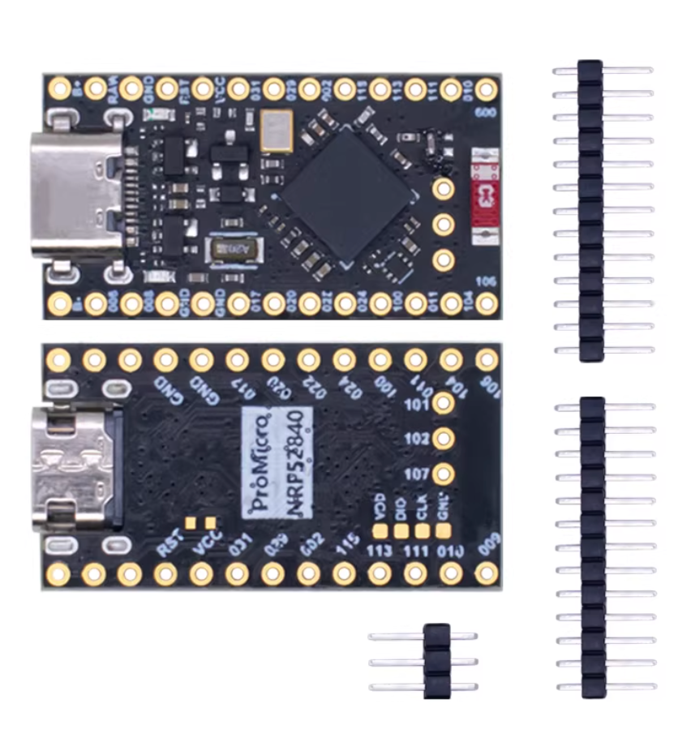
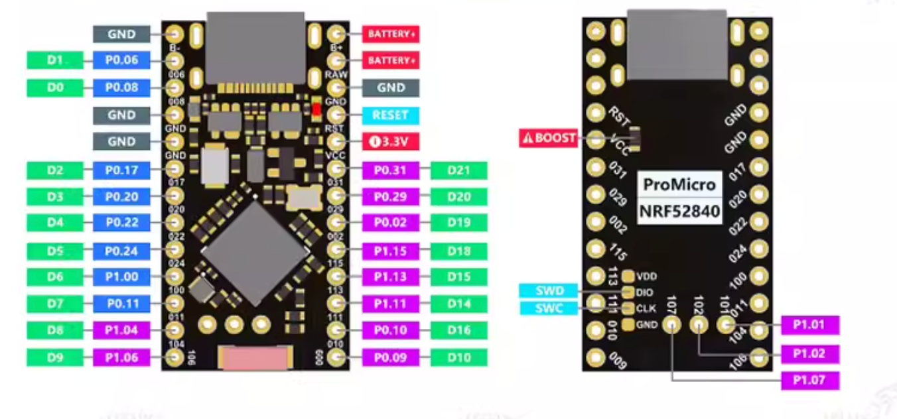
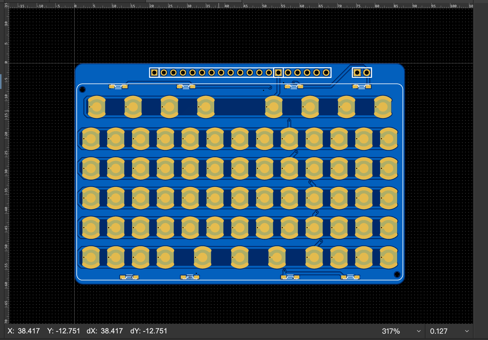

# KeebDeck BLE

nRF52840 BLE wireless keyboard project based on ZMK firmware. This repo contains hardware design resources, firmware dumps, JLink/SWD tooling, and development documentation for building a custom BLE keyboard.

## Hardware

- **MCU**: nRF52840 (ARM Cortex-M4F, 64MHz, 1MB Flash, 256KB RAM, BLE 5.0)
- **Dev Board**: ProMicro NRF52840 compatible (SuperMini / nice!nano compatible)
- **Keyboard Matrix**: KeebDeck 6R13C (6 rows x 13 columns = 78 keys, ROW2COL)
- **Bootloader**: Adafruit UF2 (nice!nano variant)
- **Firmware**: ZMK





## nRF52840 Flash Layout

```
Address       Content                     Size
──────────────────────────────────────────────────
0x000000      MBR (Master Boot Record)    4KB
0x001000      SoftDevice S140 v6.1.1      ~148KB      BLE protocol stack
0x026000      Application (ZMK)           ~824KB      zmk.uf2 writes here
0x0F4000      UF2 Bootloader              40KB        BPROT protected
0x0FE000      Bootloader Settings         8KB
0x100000      End of Flash                Total 1MB
```

### Actual Flash Usage (from JLink dump)

```
0x000000 - 0x026000  ( 152KB)  MBR + SoftDevice        [##########]
0x026000 - 0x0F4000  ( 824KB)  App region (EMPTY)       [..........]
0x0F4000 - 0x0FE000  (  40KB)  Bootloader              [##########]
0x0FE000 - 0x100000  (   8KB)  Settings (EMPTY)        [..........]

Used: 192KB / 1024KB (18%)
```

> The dev board currently only has MBR + SoftDevice + Bootloader flashed. No application firmware (ZMK) is present in this dump.

## Chip Info (from JLink)

| Field | Value | Description |
|-------|-------|-------------|
| Part Number | `0x00052840` | nRF52840 |
| Package | `0x41414430` (AAD0) | QFN48 |
| RAM | 256KB | |
| APPROTECT | `0xFFFFFFFF` | Not locked (SWD open) |
| NFC Pins | `0xFFFFFFFE` | Disabled (used as GPIO) |
| Reset Pin | P0.18 | Hardware reset configured |
| Bootloader Addr | `0x000F4000` | Adafruit UF2 bootloader |
| BLE MAC | `570FB754 B2231661` | Unique per chip |

## Project Structure

```
keebdeck_ble/
├── README.md                   # This file
├── docs/
│   ├── hacking.md              # JLink/SWD guide, firmware operations
│   └── images/                 # Hardware photos and diagrams
├── firmware/
│   ├── bootloader/             # Bootloader hex files for flashing
│   │   ├── nice_nano_bootloader-0.6.0_s140_6.1.1.hex
│   │   └── pca10056_bootloader-0.5.0-dirty_s140_6.1.1.hex
│   └── dump/                   # Flash dumps from working board
│       ├── dump_full_flash.bin  # Full 1MB flash (JLink savebin)
│       └── CURRENT.UF2         # UF2 export from bootloader USB mode
├── jlink-scripts/              # JLink automation scripts
│   ├── common.sh               # Shared variables
│   ├── 01-chip-info.sh         # Read chip registers
│   ├── 02-dump-full-flash.sh   # Export full 1MB flash
│   ├── 03-dump-bootloader.sh   # Export bootloader region
│   ├── 04-dump-uicr.sh         # Export UICR config
│   ├── 05-flash-hex.sh         # Flash firmware (full erase)
│   ├── 06-erase-all.sh         # Full chip erase
│   ├── 07-reset.sh             # Reset chip
│   ├── 08-read-memory.sh       # Read arbitrary memory address
│   ├── 09-flash-bootloader-only.sh  # Flash bootloader without full erase
│   ├── 10-gdb-server.sh        # Start GDB debug server
│   └── 11-rtt-viewer.sh        # Real-time logging (RTT)
└── LICENSE                     # MIT License
```

## Keyboard Matrix

6 rows x 13 columns, 78 key positions with ROW2COL diode direction.



### Pin Assignment

| Function | Pro Micro | nRF52840 GPIO |
|----------|-----------|---------------|
| ROW0-5 | D0-D5 | P0.08, P0.06, P0.17, P0.20, P0.22, P0.24 |
| COL0-11 | D6-D21 | P1.00, P0.11, P1.04, P1.06, P0.09, P0.10, P1.11, P1.13, P1.15, P0.02, P0.29, P0.31 |
| COL12 | Fly wire | **P1.02** (not on Pro Micro header) |

## Getting Started

### Prerequisites

- J-Link (or J-Link OB clone) for SWD access
- USB-C data cable
- macOS with Homebrew

### Install Tools

```bash
brew install --cask segger-jlink
```

### Quick Start

```bash
cd jlink-scripts

# Read chip info
./01-chip-info.sh

# Dump current firmware
./02-dump-full-flash.sh

# Flash new firmware
./05-flash-hex.sh path/to/firmware.hex
```

See [docs/hacking.md](docs/hacking.md) for the complete JLink/SWD guide including:
- Blank chip recovery
- Bootloader flashing from scratch
- Firmware extraction and comparison
- nRF52840 memory map reference

## Related Repos

- [zmk](https://github.com/zmkfirmware/zmk) - ZMK Firmware
- [Adafruit_nRF52_Bootloader](https://github.com/adafruit/Adafruit_nRF52_Bootloader) - UF2 Bootloader (recommended, v0.10.0 includes nice_nano)
- [Nice-Keyboards/Adafruit_nRF52_Bootloader](https://github.com/Nice-Keyboards/Adafruit_nRF52_Bootloader) - nice!nano fork (outdated, v0.5.1.1)

## License

MIT License - see [LICENSE](LICENSE)
