## Pro Micro Compatible

### SuperMini NRF52840

* **This is the best nRFMicro replacement, has ESD decoupling, and costs only $3. I strongly recommend buying it.**
* **New!** There's a reverse-engineered open-source version here: https://github.com/sasodoma/nrf52840-promicro (via [#80](https://github.com/joric/nrfmicro/issues/80))
* You may prefer [[nice!nano v2|Alternatives#nicenano-v2]] (similar schematics), but it's not cheap ($25): https://nicekeyboards.com/nice-nano

<details>
<summary>This is the best value, but may have reliability issues (click to expand)</summary>

<hr>

**Reliability Issues**

_I've purchased plenty of [Supermini boards](https://github.com/joric/nrfmicro/wiki/Alternatives#supermini-nrf52840) that I use for development but I would never trust them for use on a real keyboard. The working theory is that they're so cheap because they're using salvaged parts. You're essentially playing Russian roulette with whether they'll be functional on arrival, and whether they'll fail unexpectedly in the future. I ordered a couple last week and they came with chips that were manufactured in 2018 (evident by the 18XXXX on the third line of the chip)._

_On this particular unit, the current leak has been fixed. Another unit from a few weeks ago still had the same leak problem. Generally you don't know which batch your order is coming from._

_Many people have also observed issues with the 32.768kHz crystal. If you recognize that the crystal is problematic, it's easy to fix with a [small firmware change](https://zmk.dev/docs/troubleshooting/connection-issues#mitigating-a-faulty-oscillator). However the issue there is that when it's not working, there aren't obvious signs that it's the crystal aside from being told by someone here on Discord._

-- [@xudongz](https://discord.com/channels/719497620560543766/763848253996793856/1288510756249407564)

<hr>
</details>

AKA "ProMicro NRF52840" ([since 28 Sep 2023](https://www.nologo.tech/product/otherboard/NRF52840.html)). Uses ceramic antenna. Features ESD protection chip, battery charger (LTH7R or TP4054 in SOT-23-6), external 3.3V LDO with EN pin ([ME6217C33M5G](https://www.reddit.com/r/ErgoMechKeyboards/comments/16q5b2c/supermini_nrf52840_a_6_nicenano_20_compatible_mcu/k3pj764), marked J2WD). Works in ZMK as nice_nano_v2.

* Wiki: http://wiki.icbbuy.com/doku.php?id=developmentboard:nrf52840
* Also from this manufacturer: [[SuperMini NRF52840 Zero|Alternatives#supermini-nrf52840-zero]], [[nRF52840 Core Board|Alternatives#nrf52840-core-board]]
* Stores: [Taobao](https://item.taobao.com/item.htm?spm=a21dvs.23580594.0.0.1d293d0dUkJbBi&ft=t&id=729260528560) |  [Aliexpress (official)](https://www.aliexpress.us/item/1005006035267231.html?gatewayAdapt=glo2usa) | [Aliexpress (TENSTAR) (red boards recommended)](https://aliexpress.com/wholesale?SearchText=tenstar+nrf52840) | [Aliexpress (search)](https://aliexpress.com/wholesale?SearchText=supermini+nrf52840)
* Blacklisted stores: [WCMCU](https://aliexpress.ru/item/1005006343285322.html) and [A+A+A](https://aliexpress.ru/item/1005007383270623.html) - sell wrong (1.2mm PCB) connectors - [[1](https://t.me/klavaorgwork/716705)] (30 pcs batch), [[2](https://t.me/klavaorgwork/712443)], [[3](https://discord.com/channels/719497620560543766/1157825408130101349/1344675564857983090)].

**Issues**

* LED colors are swapped, RED is Bluetooth (user LED), BLUE is charger, should be vice-versa. Still an issue in March 2025.
* Voltage divider ([P0.24](https://github.com/joric/nrfmicro/issues/80#issuecomment-3123396908)) is unpopulated. VDDH switches to 5V so there's no way to measure battery on charging (see [#80](https://github.com/joric/nrfmicro/issues/80)).
* ~~Higher leak than nin/nrfmicro, 700uA with VCC off vs 20uA. (wrong pull-up resistor, see [reddit](https://www.reddit.com/r/crkbd/comments/16teax1/supermini_nrf52840_development_board_compatible/))~~ ([factory-fixed in Apr 2024](https://discord.com/channels/719497620560543766/1157825408130101349/1228533671972311060)).
* Some late batches use regular silicon diodes instead of schottky diodes (60 uA leak instead of 4 uA), see [#85](https://github.com/joric/nrfmicro/issues/85).

**Pictures**

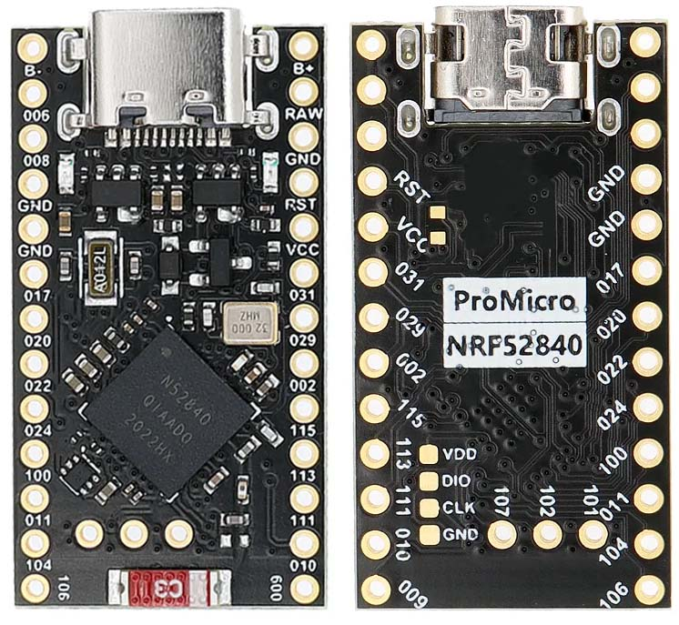

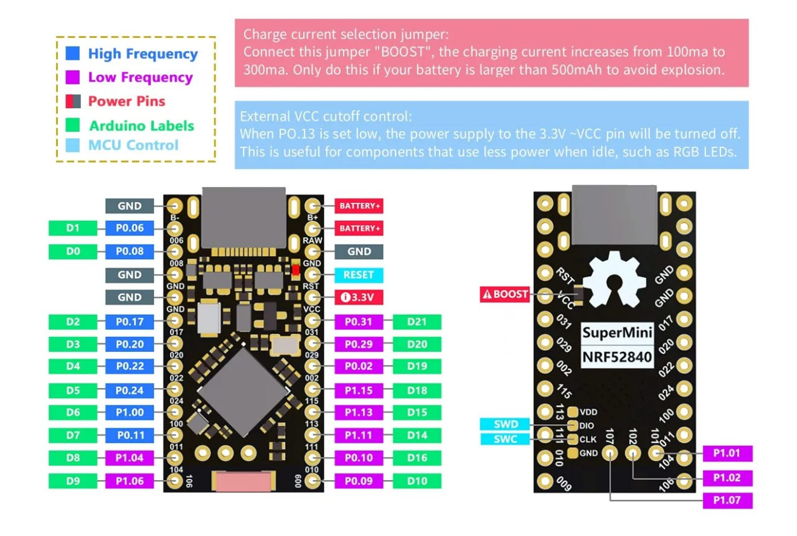

_There's also [pinout](https://github.com/user-attachments/assets/4567656d-e718-477b-ab04-8e05fe615093) by [@pdcook](https://github.com/pdcook), see https://github.com/pdcook/nRFMicro-Arduino-Core, also see [#77](https://github.com/joric/nrfmicro/issues/77) - pin naming issue_

#### SuperMini Features

* Supports charger boost jumper (100mA to 300mA) on the back side (0R resistor, 0402 footprint).
* Supports [Japanese con-through spring pins](https://github.com/joric/nrfmicro/wiki/Sockets#spring-pin-headers) and they hold pretty well. ([photo](https://github-production-user-asset-6210df.s3.amazonaws.com/852547/275974277-5cc21074-9c02-4236-a2ba-24789eba6d81.jpg)) ([video](https://github-production-user-asset-6210df.s3.amazonaws.com/852547/276197738-43bc9e0d-7ce6-426c-8fa6-b85e37c6c367.mp4))
* Supports VCC cutoff control (set P0.13 to low to turn VCC off).

#### SuperMini Schematics

Official schematics (2024-09-29, from https://chat.nologo.tech/d/80/14):


#### SuperMini Issue Fixes

Earlier batches had 5.6K pull-up resistor. Setting the power pin to GND resulted in 700 uA leak (n!n schematics for reference):

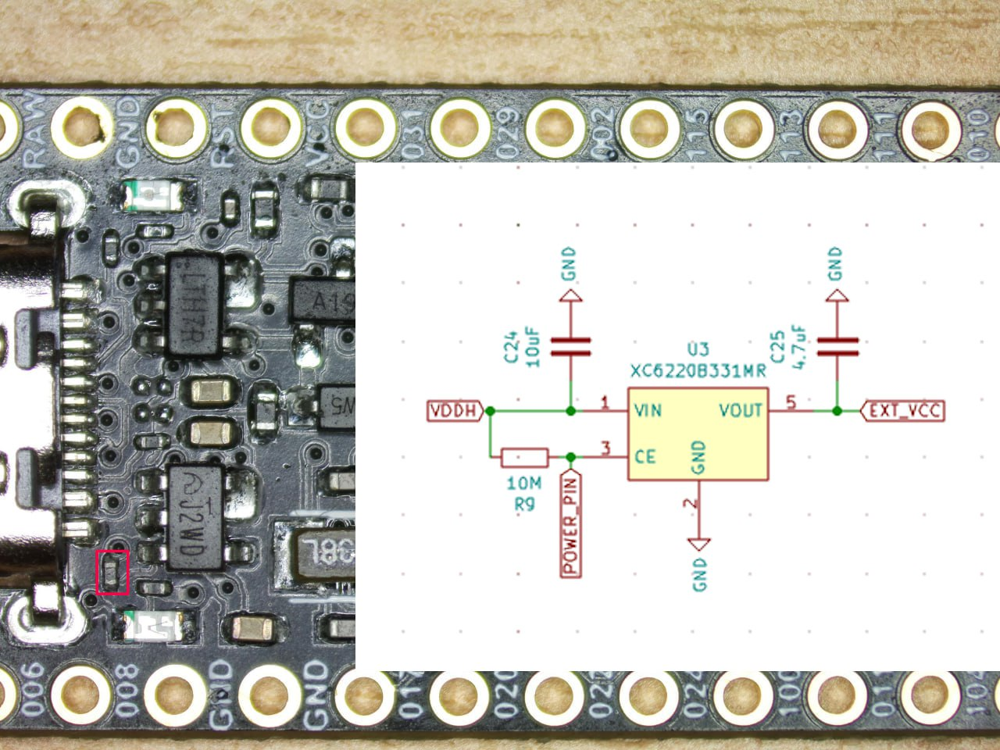

Why the resistor leaks? Because (and only) when VCC-cutoff is enabled (POWER_PIN is set to GND), it shorts VDDH and GND.

You can desolder resistor on the picture AND/OR replace it with 10M. It works fine without the resistor (it's there to pull VCC control pin up when it is uninitialized, so it mostly matters during boot time). Desoldering or replacing the resistor brings quiescent current from over 700uA to under 20uA. Later (post-April-2024) batches already have it replaced with 10M. 

<details>
<summary>Seller's description and pictures (click to expand)</summary>

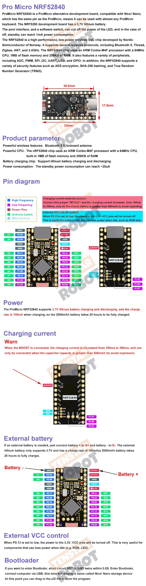

High resolution photos of the board:

* https://imgur.com/a/WVsA1NP
* https://imgur.com/a/s3ZNuny

</details>

<details>
<summary>Non-essential issues and updates (click to expand)</summary>

* August 2024 revision has a new LDO. It's either RT9013-33GB or TP2028-3.3YN5G.

1|2|3
---|---|---
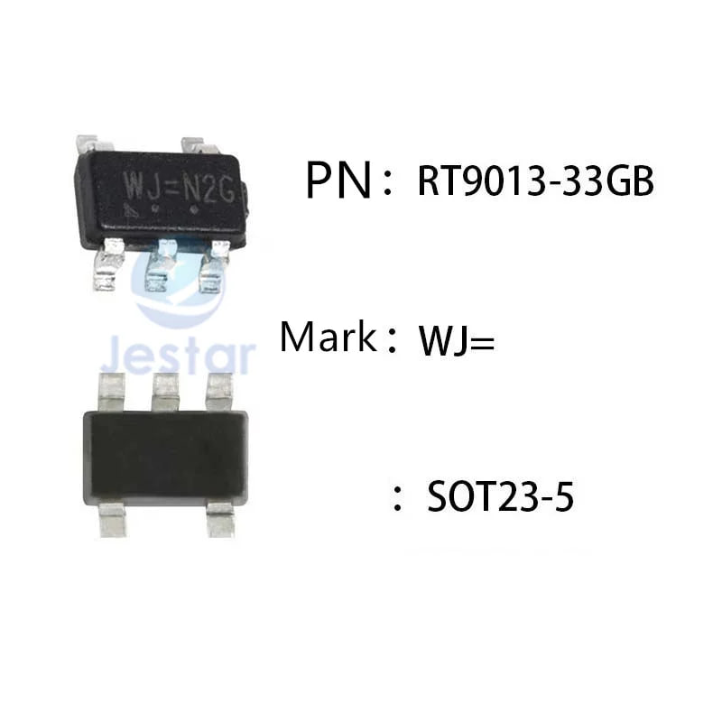|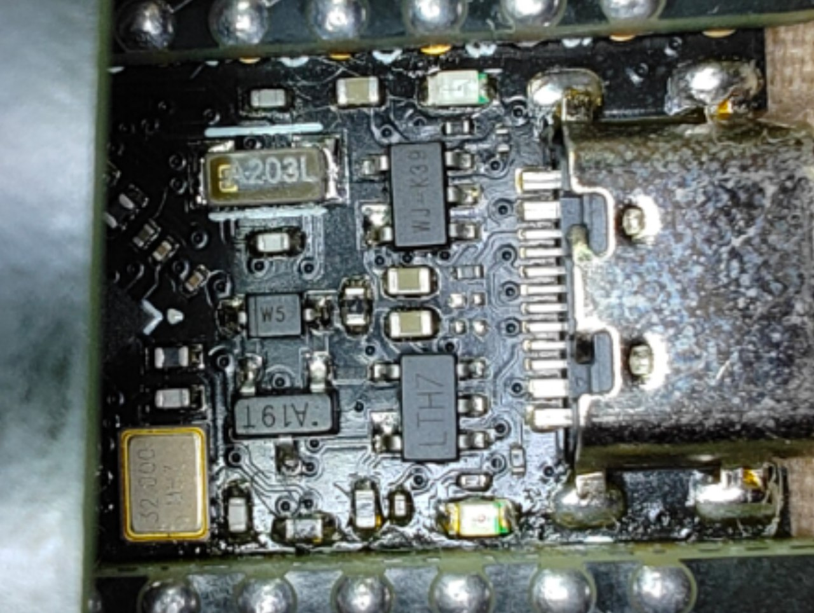|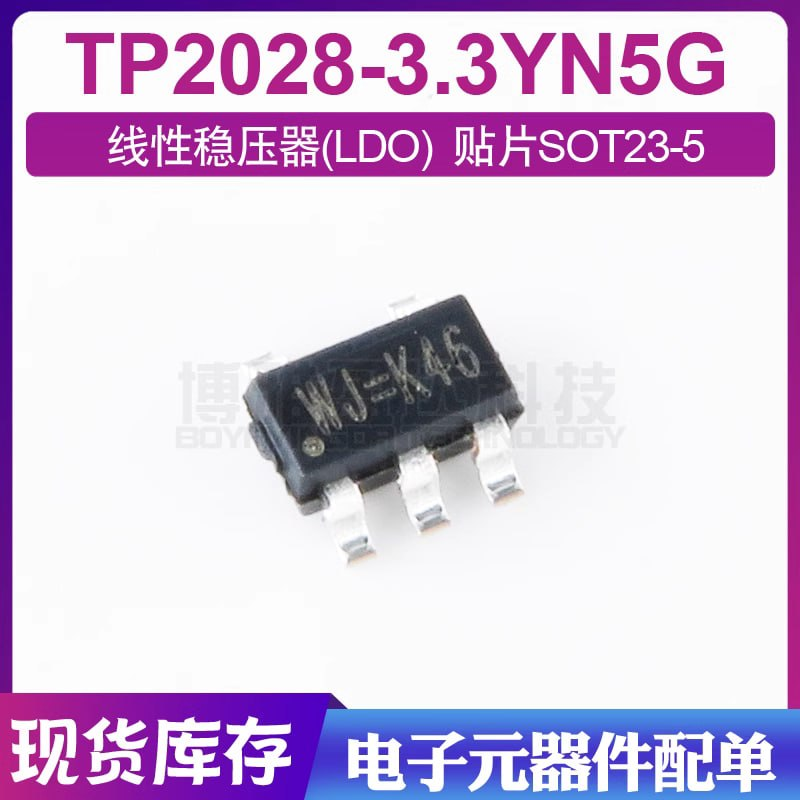

* April 2024 revision has 10M pull-up resistor, no leak issues anymore (see [ZMK discord](https://discord.com/channels/719497620560543766/1157825408130101349/1228533671972311060))

It's possible to reduce leak by replacing the pull-up resistor. Old revision reused 5.6K CC resistors to save on parts, see https://t.me/devAlphaSierra/460 (also see ZMK discord [here](https://discord.com/channels/719497620560543766/1157825408130101349/1168742350680494101)). 

It is about 3.6V/5.6K ~ 0.650 mA just from this resistor alone. 10M resistor works too (lower current, same voltage) it only affects gate saturation time (t=R*C), which is negligent (picoseconds), leak will be 3.6V/10M ~ 0.36 uA.

Piece of the original schematics ([discord](https://discord.com/channels/719497620560543766/1157825408130101349/1175776962644557864), [forum](https://chat.nologo.tech/d/80/5)), it's the original resolution:

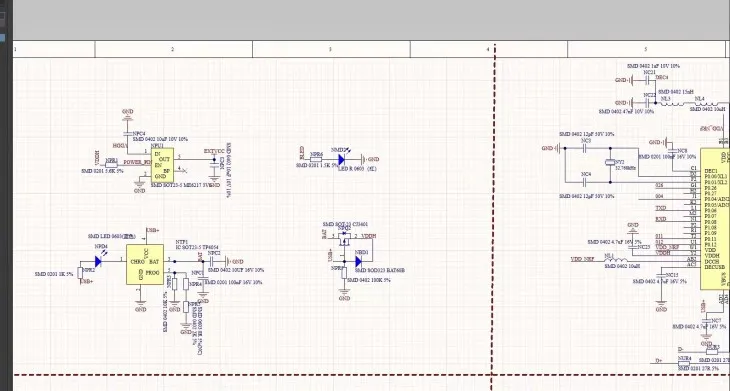

The pinout is the same as Nice!nano V2, but with a different (LTH7R) Li-Po charger. Nice!nano uses BQ24072 and when it charges, VDDH is battery voltage +0.2V so it raises as battery charges, Supermini voltage may differ.


Got my 2 boards November 30, 2023 ([image](https://github-production-user-asset-6210df.s3.amazonaws.com/852547/286828912-f2f975de-7e36-4639-a282-04576a979515.jpg)). Shipping took 19 days. Link is dead by now, use Aliexpress search. _"ProMicro" and "NRF52840" silk on the back. Bootloader shows NICENANO label on double reset, looks like stock nicenano bootloader. LEDs are swapped (Red is bluetooth, Blue is charging). 5.6K pull-up resistor between power pin and VDDH._

Also colors are messed up. Rapid blinking is charger LED (supposed to be red), slow blinking is user LED (supposed to be blue [video](https://github.com/joric/nrfmicro/assets/852547/4e38f0fe-e59a-4019-854e-fe07597272c2)). You could swap the LEDs using a hotplate or a soldering iron, preserving the polarity.

</details>

<details>
<summary>You can try reballing and re-soldering dead MCUs with 0.2 mm balls and a soldering fan (click to expand)</summary>

<hr>

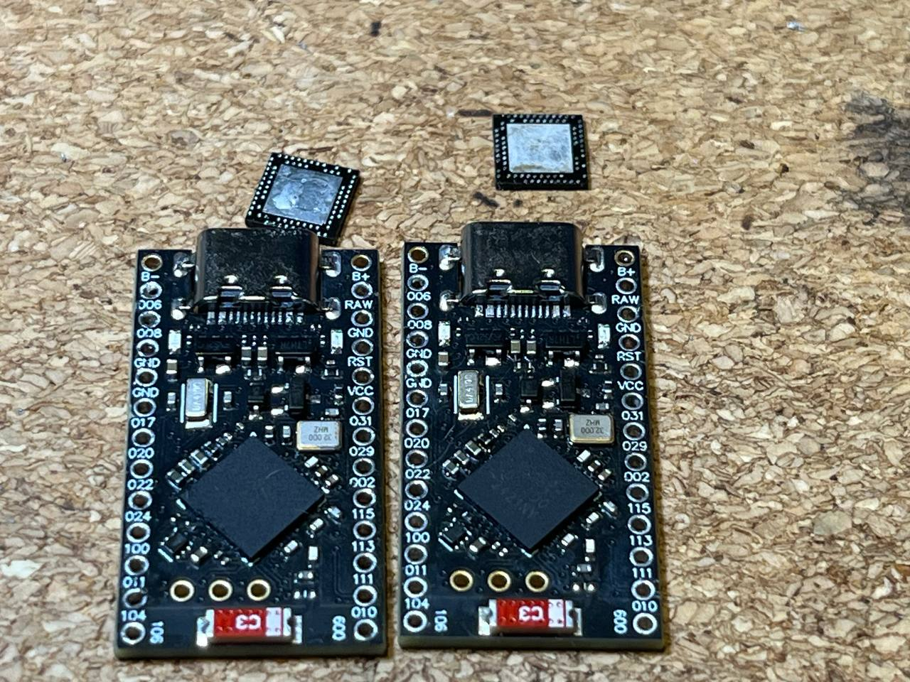

_If you happen to get defective Chainnano chips and you have enough free time or just want the challenge, you can revive them by replacing the controller._

_These didn’t die from detachment or a dead bootloader — the chips themselves failed._

_The controller itself costs around 70 rubles, not including shipping. It’s soldered with 0.2 mm balls. You flash the NiceNano bootloader onto it, and off you go._

_It takes about 30 minutes per chip if you’re casually working on it while listening to a podcast or something. I used leftover balls from a Lancet for the center._

_Ideally, if you’re doing this more than once, it makes sense to order a stencil from JLCPCB or similar — the package is unique, and you won’t find such a stencil readily available._

-- [Telegram](https://t.me/klavaorgwork/796569)

* Cheap nRF52840 MCUs to replace: https://aliexpress.com/item/1005008659267040.html

<hr>

</details>

#### SuperMini nRF52840 Red

2024-09-24 Red Superminis spotted in the wild.

_Last two Superminis I bought from Tenstar had the 10M resistors (battery performance while in deep sleep was ok, I didn’t measure resistance though), so I think the chances are pretty high._ ([Discord](https://discord.com/channels/719497620560543766/1157825408130101349/1289856727759716363))

* https://aliexpress.ru/item/1005007738886550.html
* https://aliexpress.ru/item/1005008099333183.html

Ships in bulks, 2 pcs for $5.34, 4 pcs for $10.68 (~$2.67 a piece). Shipping may vary.

Features the same schematics and the same SMD antenna as on the old model it's just red on red.

Red Superminis also feature updated LDO regulators marked S2LC (possibly ME6211) [[1](https://discord.com/channels/719497620560543766/763848253996793856/1357218949229449236)], [[2](https://www.reddit.com/r/esp32/comments/1j8cbjv/esp32_super_mini_board_series_what_low_dropout/)].

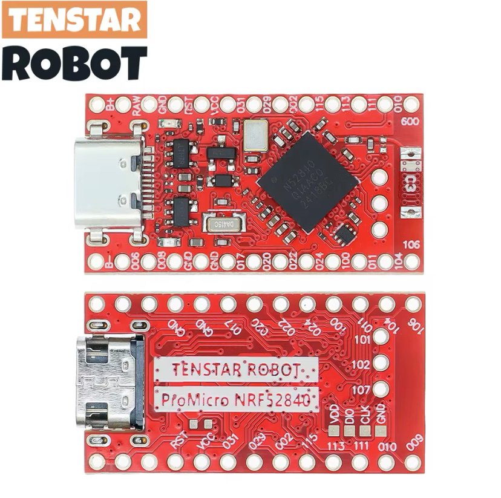

Black TENSTAR boards feature 600K resistors. LED's are still swapped though ([Telegram](https://t.me/klavaorgwork/719376)). No TENSTAR branding.

Front | Back
------|-----
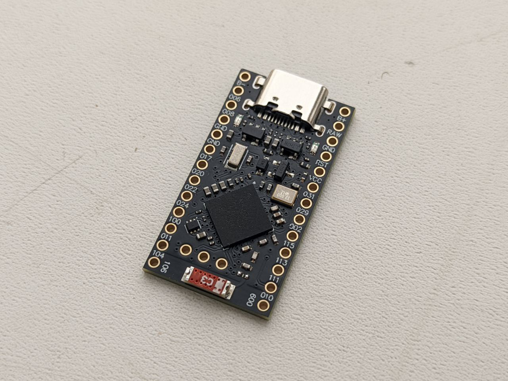|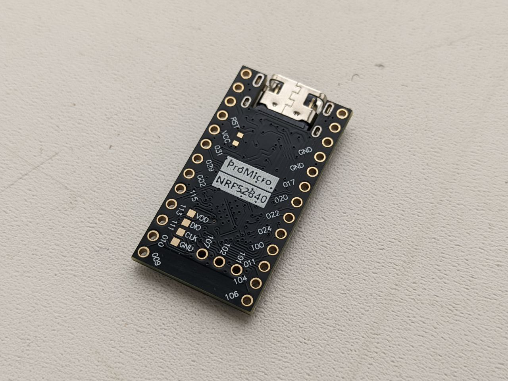

* 2025-03-02: Black/Red TENSTAR boards have 500k+ resistors so there is almost no leak (3.3V/500k = ~6uA) ([discord](https://discord.com/channels/719497620560543766/1157825408130101349/1345797649361535067)).
* 2025-07-14: 6 out of 18 black TENSTAR boards ought to be faulty, so beware ([Telegram](https://t.me/klavaorgwork/795351)). Red all good.
* 2026-03-03: Apparently, you should power-cycle the board after flashing, to re-enable deep sleep, see [#87](https://github.com/joric/nrfmicro/issues/87).

### 52840nano

#### 52840nano V1

<details>
<summary>Archived (click to expand)</summary>

Sometimes erroneously referred as SuperMini V2, but it's a totally different board from a different manufacturer. Has LPS BMCU3 (LP4057 Battery Management Chip in SOT23-6), a 6-pin ESD protection chip and no external LDO (routes VDDH voltage directly to EXT_VCC). Works with nice_nano_v2 board definition.

* https://aliexpress.com/item/1005006112197135.html (New!)
* https://item.taobao.com/item.htm?spm=a230r.1.14.34.70a713ce8xCC6X&id=714225655665&ns=1&abbucket=9#detail/

As explained in the Taobao lot, there are two batches, one with a refirbished/relabeled MCU (cheaper).

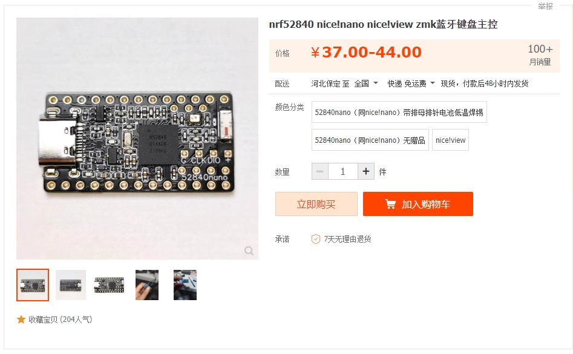

Issues:

* Revision 3.2 has two blue LEDs instead of red/blue ([video](https://github-production-user-asset-6210df.s3.amazonaws.com/852547/277726747-6ce3a881-7674-4542-a687-b8e0d0fd4a27.mp4)).
* There's no EXT_VCC control and no pull-up resistor, so it leaks less if there's no peripheral. However it will leak IMMENSELY with RGB/OLED on the power bus, e.g. 28 LEDs (even turned off) leak 28 mA and kill 100 mAh battery in 3 hours.
* VCC output is unregulated (no external LDO), so we get 4.5V from VUSB after the diode, and up to 4.2V from the battery ([image](https://github-production-user-asset-6210df.s3.amazonaws.com/852547/276870936-bc4711b2-a260-475f-a6f0-7f24b5b9008d.jpg)). It WILL burn your peripherals if they are not 5V tolerant (don't hook expensive Nice!view displays to it).
* Uses voltage divider instead of sensing on VDDH, you need to use ZMK software patch, or the level would be off:

```
If you want the power detection to be more accurate, add a line of code for power detection in the device tree.
vbatt:vbatt {compatible = "zmk, battery-voltage-divider";label = "BATTERY";
io-channels = <&adc 2>;
output-ohms =<2000000>:
full-ohms = <(2000000 +806000)>;pintopin compatible promicro
```

front | back
---|---
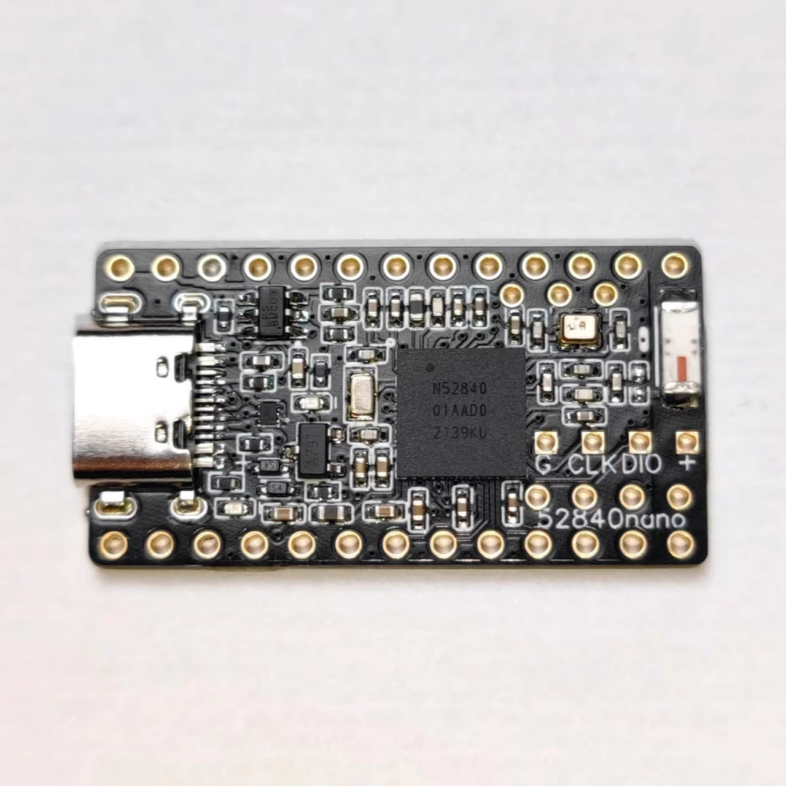|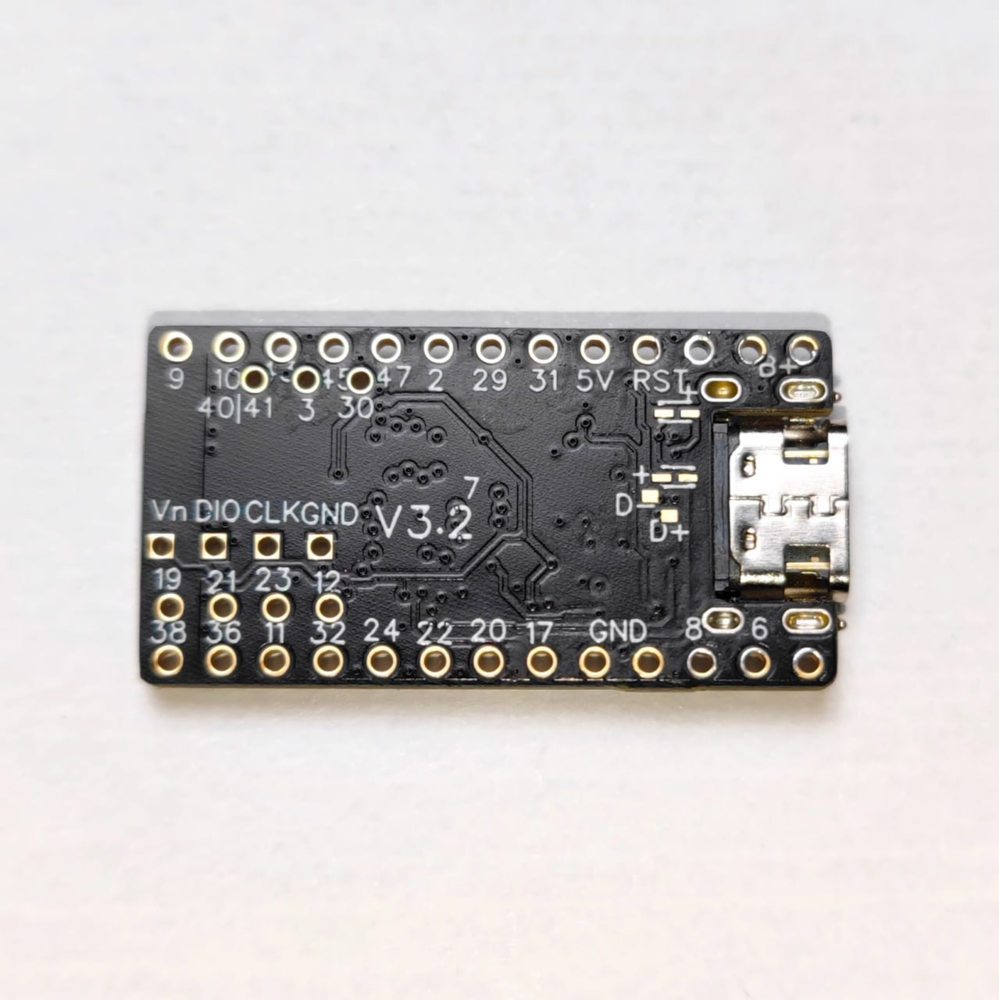

More pictures: [52840nano](https://github-production-user-asset-6210df.s3.amazonaws.com/852547/288345020-547a4f99-bb3e-4e50-b397-ee9d7c01785b.jpg)

</details>

#### 52840nano V2

This board is pretty good, it's on par with SuperMini with even more GPIO pins.

52840nano edition with voltage regulator on board (there's a nice!nano v2 compatible VCC on/off function with active pin high on P0.13), and 3.3V on VCC pin. Check pictures before buying (note an extra SOT23-5 package). It also provides more GPIO pins than SuperMini. First noticed 2024-07-10 ([discord](https://discord.com/channels/719497620560543766/1260555272414298293/1260555273970389094)).

Aliexpress US sells basic version for $3.90, IPEX antenna version for $5.63. Though prices start from ~$11 after logging in.

* https://www.aliexpress.us/item/3256805975015643.html (us)
* https://www.aliexpress.us/item/3256806028890415.html (us sold out)
* https://aliexpress.ru/item/1005006161330395.html (~$9 + $3 shipping)
* https://aliexpress.ru/item/1005006652844693.html (~$6, IPEX antenna only)

The marking says Vebo (or Veto?). P-FET is NCE3407, charger is LPS BMEm1 (LP4057), 3.3V LDO is VAXC (AP2122).
LEDs are blue and green, with the blue slowly "breathing" and the green flashing a couple of times a second. Must be user and charging LEDs accordingly.

Front | Back
---|--
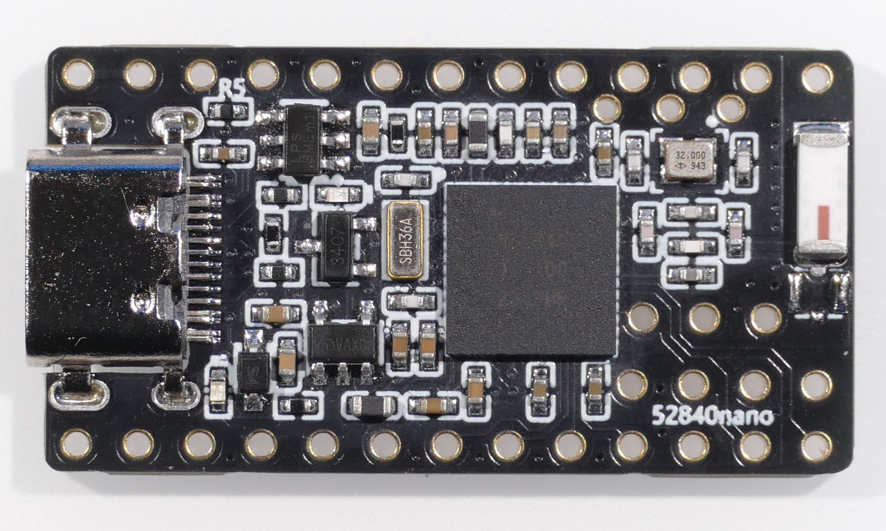 | 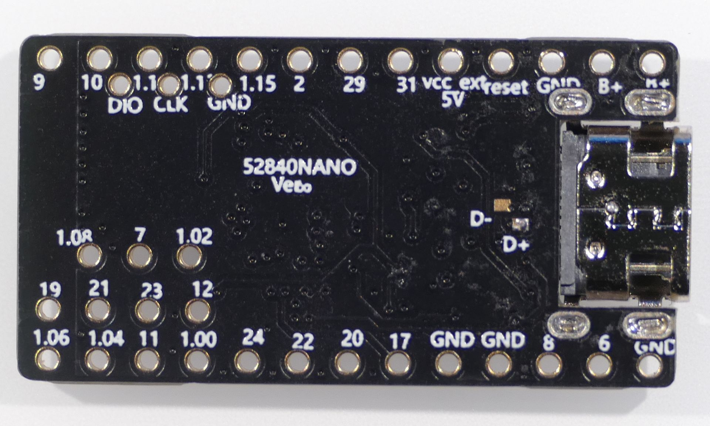

SMA (IPEX) connector version, no ceramic antenna on board:

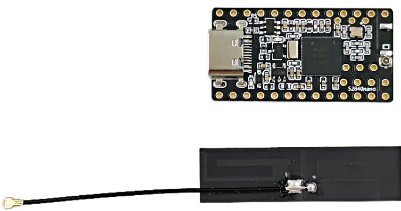


### Nice!nano

Pro-Micro compatible. Uses midmount USB-C connector. Has nRF52840 soldered on board. Built in Li-Po charger (MCP73831-based in V1). Has 3+ extra GPIO pins. Has external XTAL. Runs ZMK firmware. Closed source hardware (based on the reference nRF52840 QIAA layout with the PCB antenna). The board height is about 3.2 mm (0.55mm thinner than Pro Micro).

* https://www.reddit.com/r/MechanicalKeyboards/comments/fzlfy8/fully_wireless_lily58_pro/
* https://imgur.com/a/OWH4Cym (images)
* https://discord.gg/CHd6hUy (discord)
* https://redd.it/gsszq7 (the final IC posted on r/mk, 29 May 2020)
* https://redd.it/gst1n6 (IC posted on r/mm)
* https://nicekeyboards.com (shop)
* https://docs.nicekeyboards.com (documentation)

#### Nice!nano V1

<details>
<summary>Archived (click to expand)</summary>

Build log:

* [2020-04-12](https://discord.gg/CHd6hUy), _I just ordered v0.2 with a fixed power system from my PCB maker. I expect to get them in a month... Maybe. I'm currently using two of these to type on a split Lily58 Pro wirelessly-sort of. The firmware I'm using is a modified version of QMK that has a lot of shortfalls. If v0.2 turns out good, and I have a base level firmware working, I will start a group buy._
* 2020-04-23, Nice!nano 0.2 is finished (features external 3.3V AP2112 LDO).
* 2020-04-25, Nice!nano 1.0 design exposes 21 pins via thru hole and 2 extra pad pins on the back for a total of 23 pins (changed the pin layout of 009, 010, 106, and 104).
* 2020-05-29, the final, more public IC posted to r/mk and r/mm.
* 2020-06-20, GB started and finished. 1000 boards sold in about 2 hours.

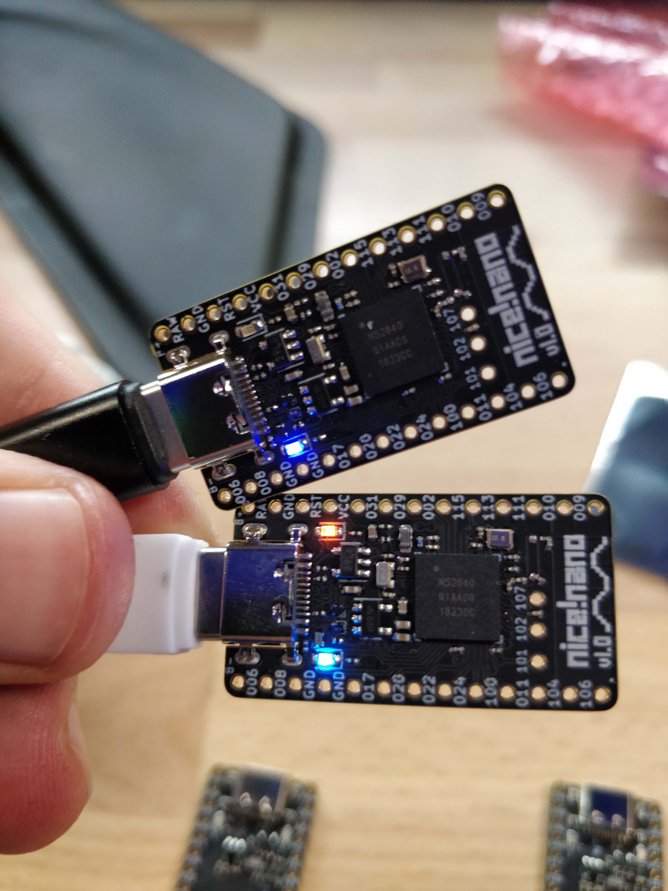

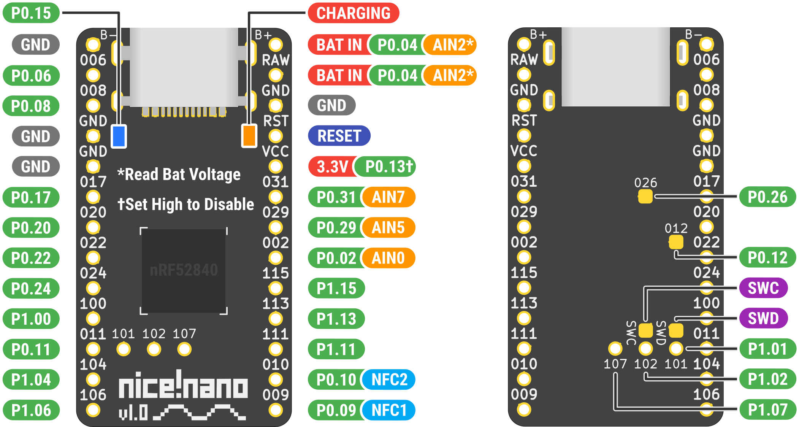

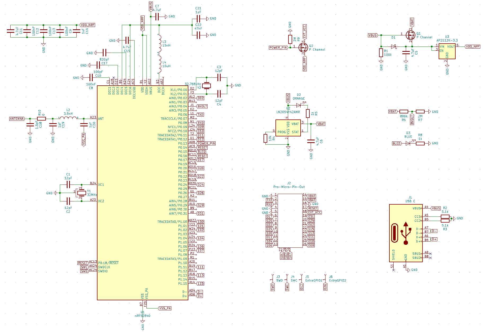

* Schottky diode: PMEG4010ESBYL in DSN1006-2 package (up to 1A)
* Charger: LN2054Y42AMR (code 2YL6, up to 500 mA charging current)
* Regulator: AP2112K (code G3P, up to 600 mA, leaks 55uA), you can replace it with XC6220 (up to 1A, leaks 8uA)
* P-MOSFET: DMP2088LCP3-7 in X2-DSN1006-3 package

</details>

#### Nice!nano V2

* https://discord.com/channels/675924128108118016/698923975002292245/862840289835614268
* No battery voltage divider, but BQ24072 provides battery voltage on VDDH pin (adds 0.2V while charging).

Schematics has BQ24075 (shows 5V while charging) but it always been BQ24072 since the second batch ([@Nicell](https://discord.com/channels/719497620560543766/1157825408130101349/1368310352852422786)).

Nice!nano v2 schematics and pinout: https://nicekeyboards.com/docs/nice-nano/pinout-schematic

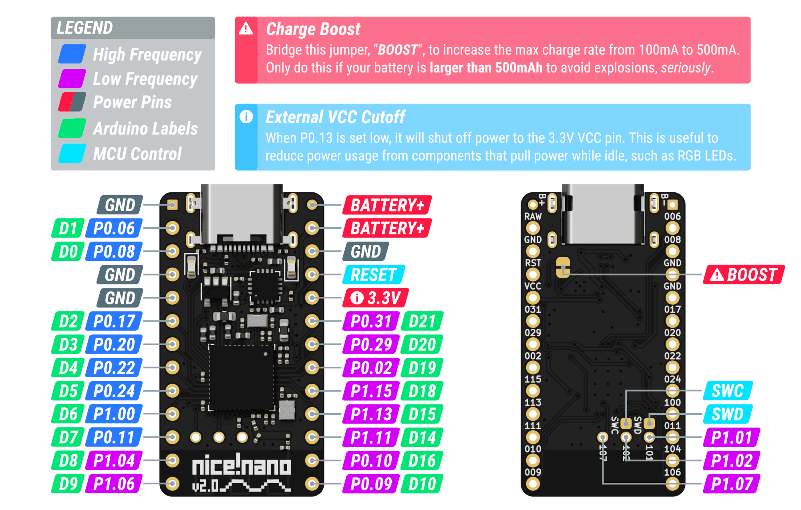

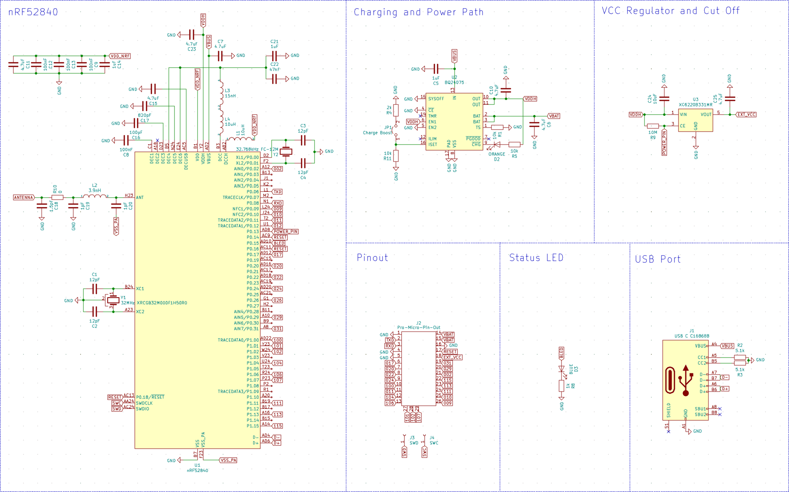

### Puchi-BLE

Officialy endorsed preassembled nRFMicros (version 1.4+ with a built in hardware switch).

* https://keycapsss.com/keyboard-parts/mcu-controller/202/puchi-ble-wireless-microcontroller-pro-micro-replacement

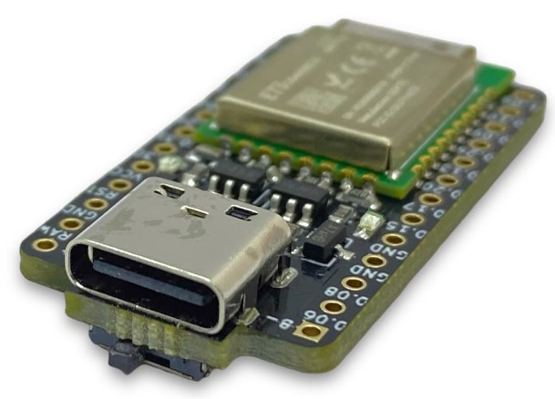

### BLE-Micro-Pro

A board that started it all. Runs QMK firmware (open source [nrf52 branch](https://github.com/sekigon-gonnoc/qmk_firmware/tree/nrf52)). Pro-Micro compatible. Uses [Lairdtech BL654](#lairdtech-bl654) module, assembled board sells for about $36. Schematic is open, but no PCB gerbers available for this board. Very hard to assemble at home, the module has a lot of small underside pins. A single 32Mhz 4-pin oscillator on the module, no external XTAL. Does NOT have a battery charger.

* https://nogikes.booth.pm (Online shop, sells for 4000 JPY, about $36)
* https://yushakobo.jp/shop/ble-micro-pro (online shop, sells for 4000 JPY)
* https://github.com/sekigon-gonnoc/BLE-Micro-Pro
* https://github.com/sekigon-gonnoc/BLE-Micro-Pro/blob/master/schematic.pdf
* https://github.com/sekigon-gonnoc/qmk_firmware/tree/nrf52
* https://discord.gg/MqufYtS (Ble-Micro-Pro Discord channel, ask @_gonnoc)

Currently ships with midmount USB-C and a preinstalled bootloader (BLE-Micro-Pro Default Firmware, see https://github.com/joric/qmk/wiki/BMPAPI) that allows editing keyboard layouts and keyboard options via text files on the internal USB drive.

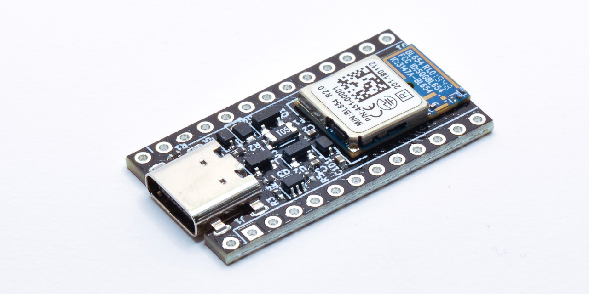

### BlueMicro

Forked from nRFMicro design by [jpconstantineau](https://www.reddit.com/user/jpconstantineau) (formerly nrfMicro v2). Adds a separate battery measuring circuit. Same set of pins. Same voltage regulator (no high voltage mode). Has 32kHz crystal on board. Non-reversible.

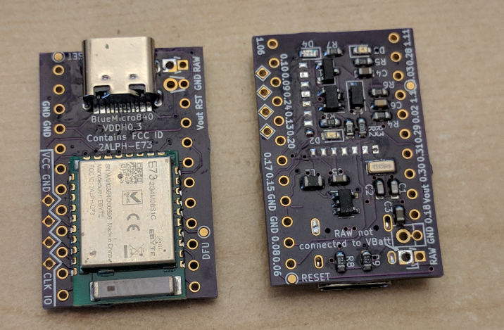

* https://store.jpconstantineau.com **you can buy preassembled boards here** (new!!!) 
* https://github.com/jpconstantineau/NRF52-Board (open source for now, follow the updates)
* [Live Build: a nRF52840 with the form factor of a Pro Micro!](https://www.youtube.com/watch?v=ZUOJoJSWu-E) (Youtube)

_I took Joric's first design of the nrfMicro and made my own adjustments to include the features of the BlueMicro.  I used 0402 components and a super tiny mosfet. It includes an on-board LiPo charger.  This is a simple two-sided board.  My next iteration for this board will replace the mosfet by a slightly larger one and all 0603 components and will probably use a 4 layer board._

_I tested it with Adafruit's Arduino library and bootloader and it works.  Flashing to it once a program has been uploaded it tricky and best done by re-flashing the bootloader._

* Voltage regulator: AP2112K-3.3V (SOT-23-5)
* Power source selector mosfet: LP0404N3T5G (SOT-883)
* Power source selector diode: B140WS-7 (SOD-323)
* Battery management IC: TP4054ST (SOT-23-5)
* Battery voltage divider: 800K/2M (0402)

<details>
<summary>Media (click to expand)</summary>

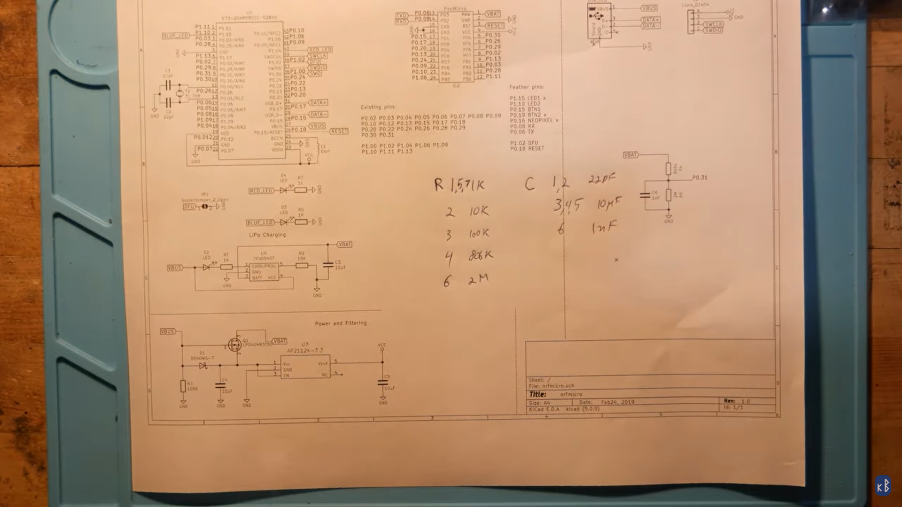

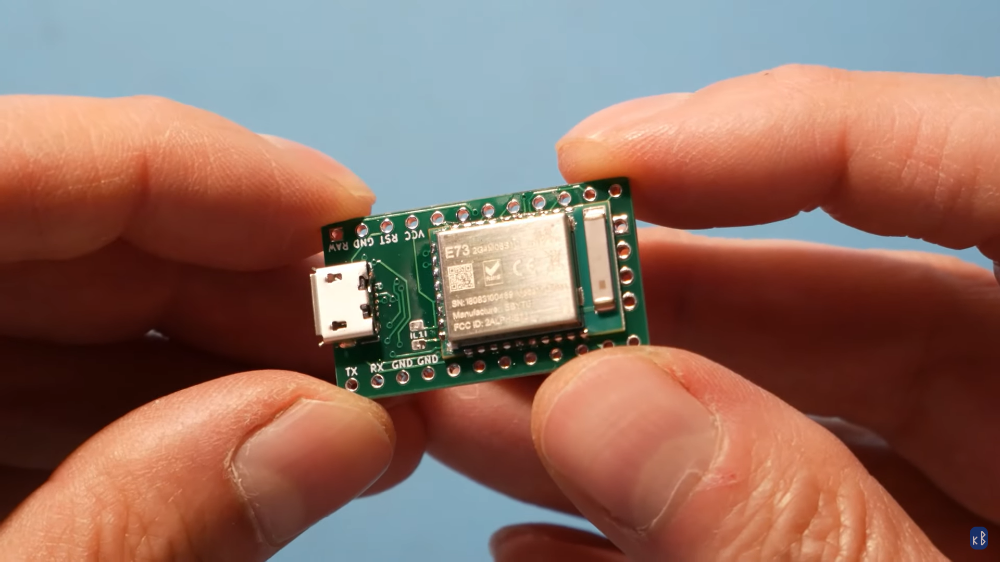

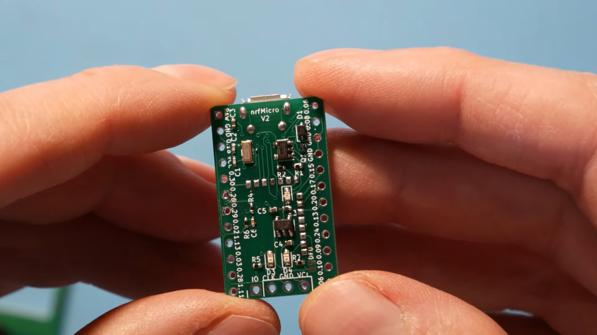

Video about assembling those boards:

[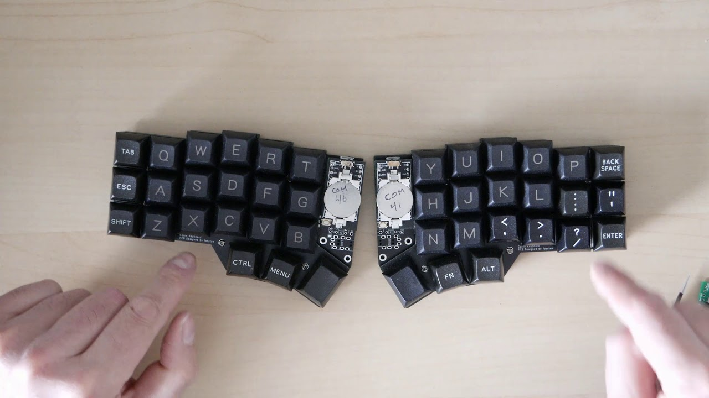](https://youtu.be/ZUOJoJSWu-E)

Recent video about wireless Corne using those boards:

[](https://youtu.be/CpmQc1aTDpA)

</details>

Also check out recent videos: 

* https://www.youtube.com/channel/UCFpGp4hHe03nvF9c8_gF_jA

There are also old Bluemicros that do NOT support wired connection (uses nRF52832-based E73-2G4M04S1B module, so no hardware USB on the board), but have Li-Po charger on board (USB is used only for charging). Runs its own firmware but it's possible to run full QMK (nrf52 branch) on it, see [jian_bm](https://github.com/joric/qmk_firmware/wiki/jian_bm). The board is much longer than a regular Pro Micro so it's not really suited for the small keyboards such as Corne and Jian (Iris is fine). No indicator LEDs.

* https://github.com/jpconstantineau/NRF52-Board (hardware)
* https://github.com/jpconstantineau/BlueMicro_BLE (firmware)
* https://github.com/joric/BlueMicro_BLE/tree/joric-nyquist (my branch for Nyquist)
* https://github.com/joric/qmk_firmware/wiki/jian_bm (alternative firmware)

There also new BlueNano boards in the repository but they still don't support USB connectivity (nRF52832-based).

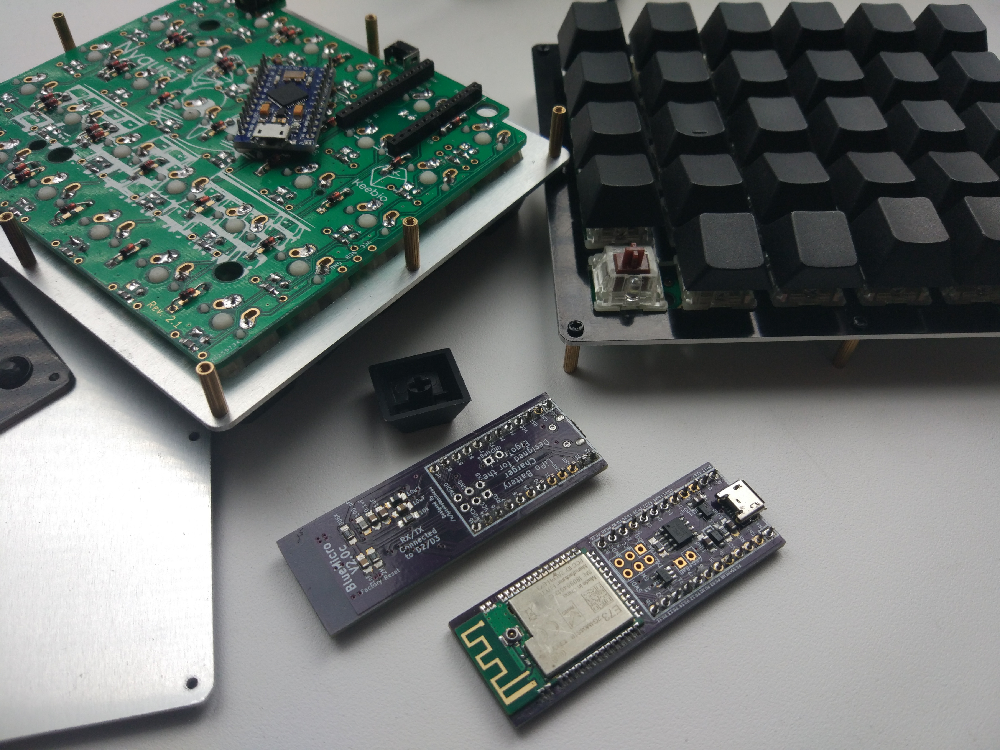

### Bluephage

Announced 20 Dec 2020 by https://www.reddit.com/user/SouthPawEngineer. Longer than Pro Micro (extra 2 rows of pins at the bottom) so it might not fit Corne. Uses mid-mount USB-C connector. Has battery gauge (probably LC709203 because it's the only one I found supported by CircuitPython). Has 2Mb SPI flash on board. Has regulated 3V with power switch on VCC pin and unregulated 5V/4.2V output on a RAW (?) pin. Not sure what does SW pin do. 

* https://www.reddit.com/r/olkb/comments/kh5g9n/meet_the_bluephage_express_a_bluetooth_keyboard/
* https://www.reddit.com/r/MechanicalKeyboards/comments/kh58vn/meet_the_bluephage_express_a_bluetooth_keyboard/

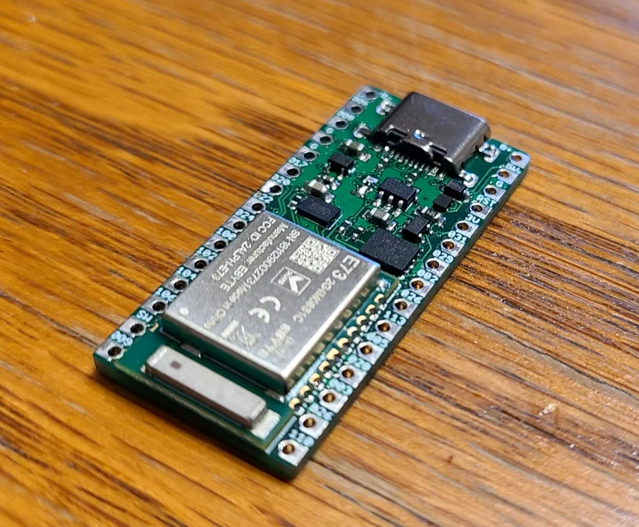

### Mikoto

Mikoto is a new ready to manufacture open-source PCBA alternative to nice!nano.

* https://github.com/zhiayang/mikoto

You can't really buy Mikoto at the moment, only assemble by hand. There are no production/placement files in the latest revision.

* 2021-06-08 zhiayang @ discord: [most things seem to work, including bluetooth but looks like the antenna needs tuning](https://discord.com/channels/675924128108118016/718847575234445453/851478675811205150).

It's a 4-layer 1.6mm board with ENIG plating (JLCPCB has a bunch of weird restrictions - no 0.8mm for 4L, and no ENIG for 2L 0.8mm) following reference config 4 with the high voltage mode. All elements are 0402 or bigger (though JLCPCB has a bunch of [0201](https://jlcpcb.com/parts/componentSearch?isSearch=true&searchTxt=c270781) elements now). Costed about $80 for 2 pcs. The name is みこと in Hiragana, (Mikoto, it's a character from [Railgun](https://en.wikipedia.org/wiki/A_Certain_Scientific_Railgun)).

Midmount connector was soldered at home because JLCPCB didn't have those connectors (now they do, search for [C168688](https://jlcpcb.com/parts/componentSearch?isSearch=true&searchTxt=C168688) or [C168689](https://jlcpcb.com/parts/componentSearch?isSearch=true&searchTxt=C168689) for 1.6 and 1.0 mm accordingly). 

**Upd:** It's open source now: https://github.com/zhiayang/mikoto looks like antenna is okay.

More pictures: [front](https://i.imgur.com/s041084.jpg), [back](https://i.imgur.com/DnyNBaR.jpg), [panel](https://i.imgur.com/pKoHsUx.jpg).

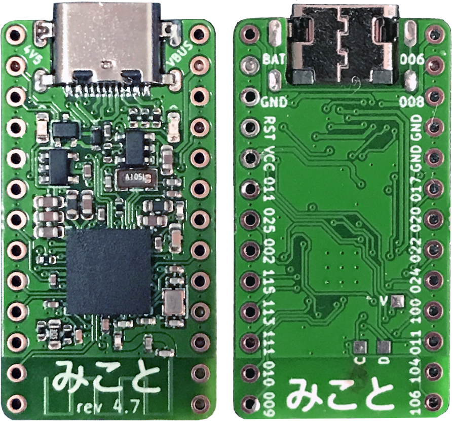

The panel looks like this:

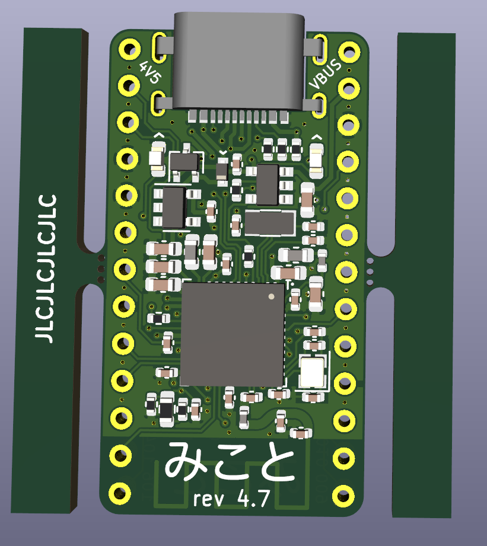

**Upd.** version 5.1 uses nicenano 2.0 schematic. This one is assembled at home (issues with pin 1.11, [discord](https://discord.com/channels/675924128108118016/718847575234445453/877085971781406720)):


It still uses 0402 components, there are no 0201 parts, which is good. It's still 4-layer which is bad.

**Upd.** 2021-08-18 figures 1.11 was missing because of that (fixed now): 

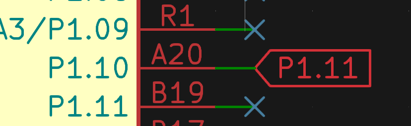

Sadly 5.x stopped provide production files for JLCPCB so you can revert to 4.7, or (better) add BOM to 5.x.

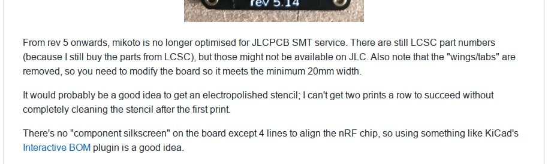

It uses the same battery management IC as nicenano 2.0, bq24075 (JLCPCB has it in the extended parts, it costs about $1/pcs):
https://jlcpcb.com/parts/componentSearch?isSearch=true&searchTxt=bq24075

Mikoto soldering video:

[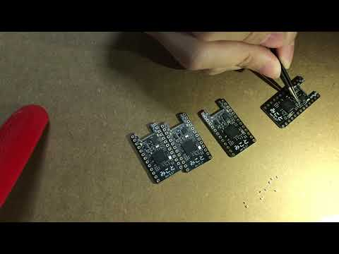](https://youtu.be/7LHZUMWAWVo)

There’s no official ZMK support, and the charger is software controlled. Won’t charge if you don’t pull down at least one of the control lines.

### IFNano

Another open source board, 2-layer

* https://github.com/joric/if-nano

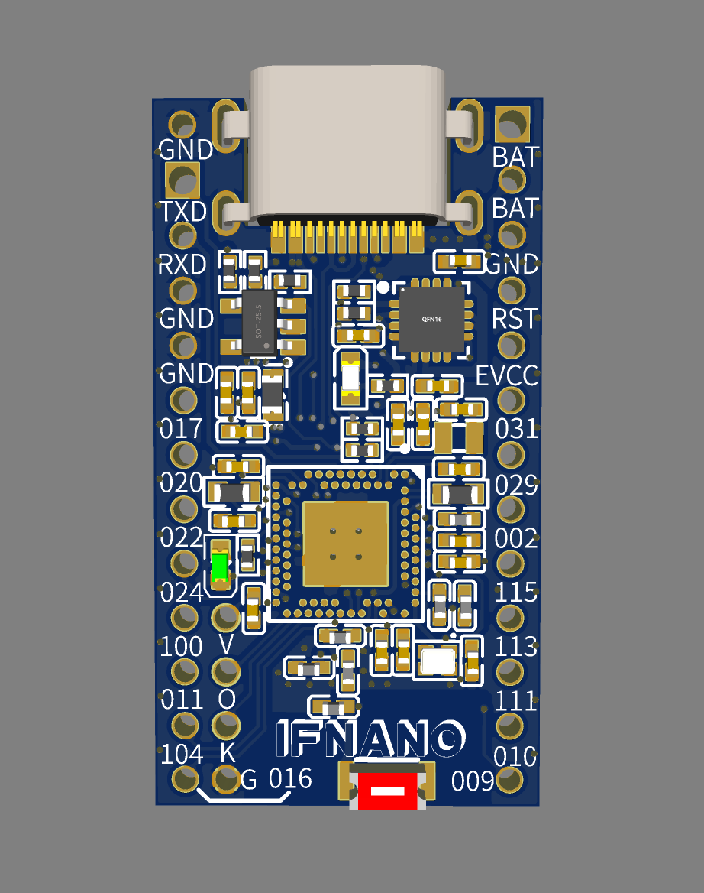

### Atlas Micro BLE

* https://www.tindie.com/products/yhkeyboards/atlas-micro-ble/
* https://github.com/ianchen06/atlas_micro_ble
* https://d3s5r33r268y59.cloudfront.net/datasheets/25156/2021-10-17-08-25-31/atlas_micro_ble_ms88sf3_schematic.pdf

```
What is it?
Pro Micro pin compatible Bluetooth Low Energy(BLE) module
Can be used as a drop-in replacement for Pro Micro in custom keyboards.
This module is pin compatible with Nice!Nano, so it is compatible with ZMK/Bluemicro firmware.
Why did you make it?
I wanted to have a Pro Micro compatible BLE module that complies with FCC regulations.
What makes it special?
Uses FCC certified and Nordic semiconductor certified module partner's module.
```

I have to note though, that contrary to a popular belief, putting FCC certified module on the board doesn't make the whole product FCC certified.

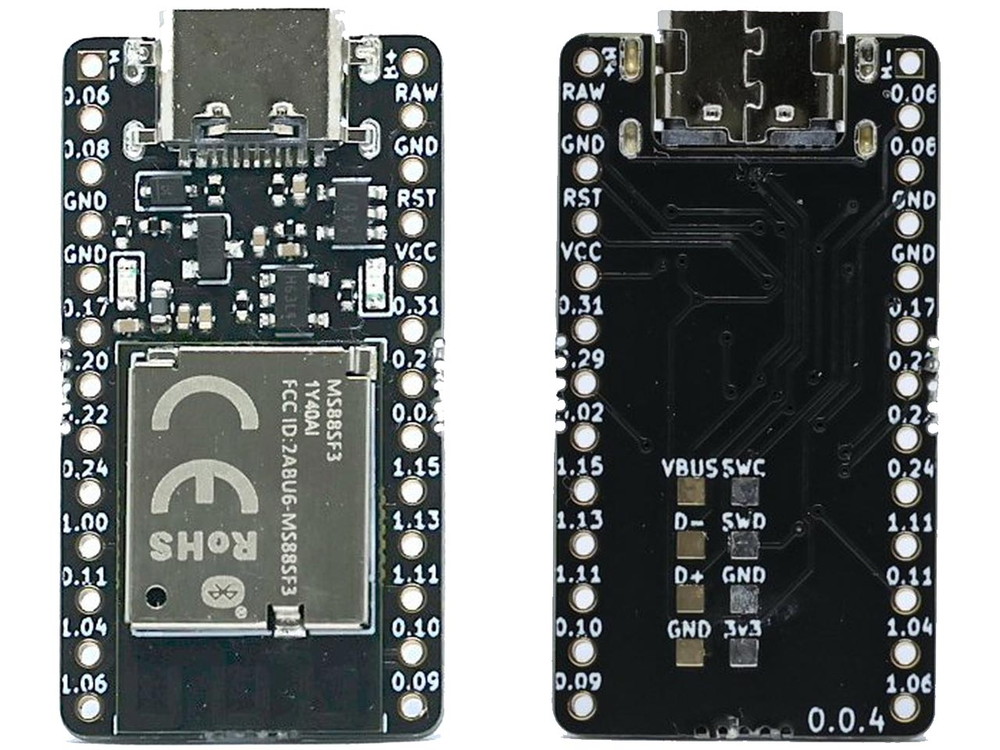

## Wired commercial boards

This section is for reference

### Pro Micro

Non-wireless, single-sided, Atmega32u4 based. Uses Micro USB connector. Usually cheap replicas of the original Sparkfun Pro Micro.
MicroUSB connector is surface mounted and prone to breaking off.

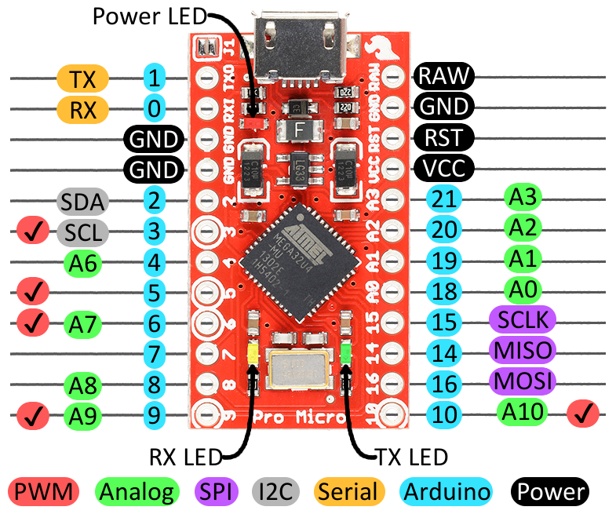

* https://www.sparkfun.com/products/12640


Black ones have tougher connector, you can buy them here: https://www.aliexpress.com/item/32849563958.html 

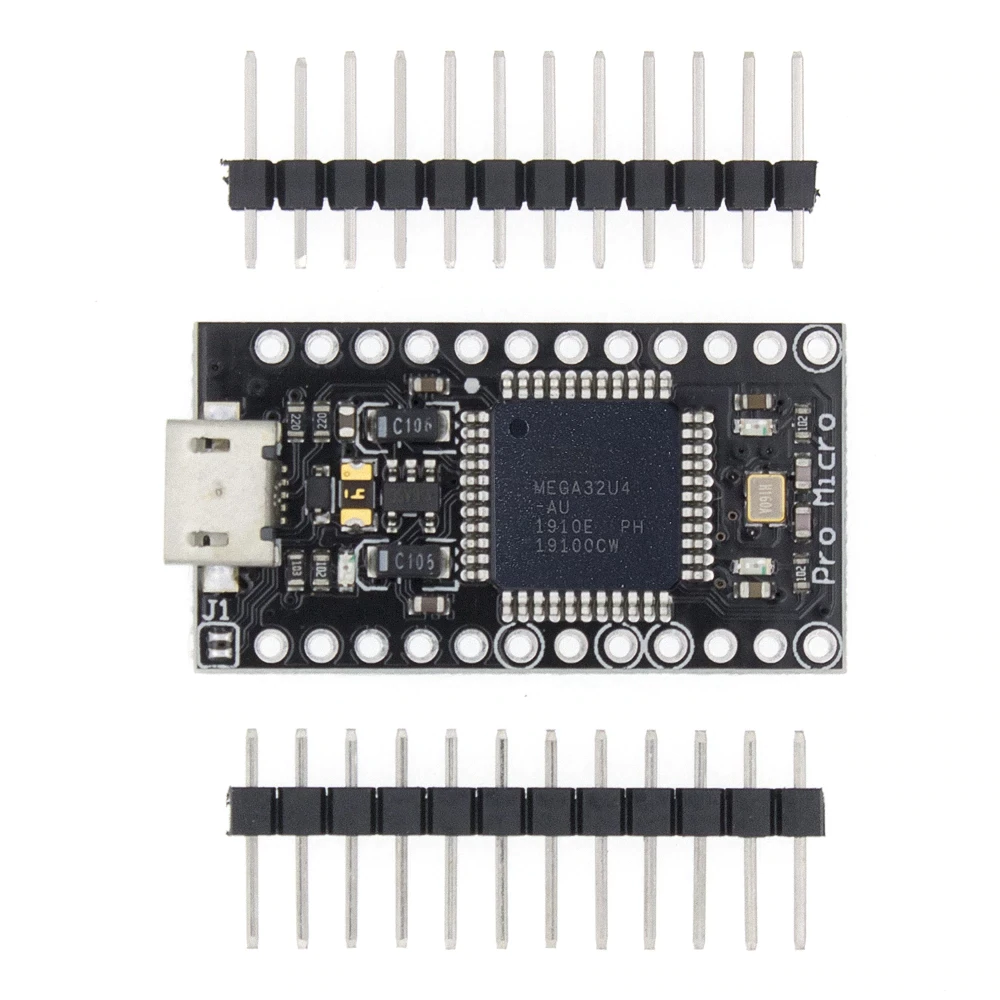

There are also USB-C boards, fully compatible with black Pro Micros but with top-mount USB-C (makes it ~ 1 mm taller than MicroUSB versions, about 1.6+3.2=4.8 mm overall, connector takes 3.2 mm so you can't use it with the Japanese 2.5mm con-through headers). Only comes in blue color up to date. The board is also ~ 2 mm longer to account for the USB-C connector.

* https://www.aliexpress.com/item/1005003227933812.html

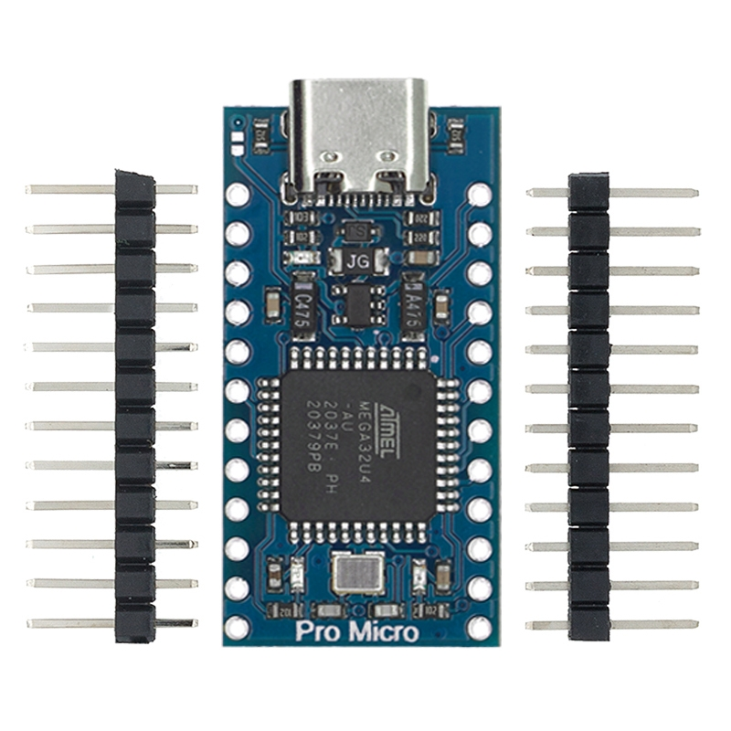

Note that Purple Pro Micros with USB-C (Blue probably too) are incompatible with Japanese Con-Through (spring) pins, see
[[Sockets#spring-pin-headers]].

Larger USB-C boards don't have 5.1K pull-downs so they don't support C-C cables, see https://github.com/joric/jorne/issues/19

* https://www.aliexpress.com/item/32840365436.html

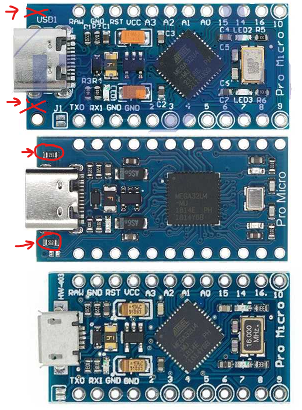

There is also a double sided version (it's about 1 mm thicker). Doesn't have CC pull-downs so no C-C cables support.

* https://aliexpress.com/item/1005004242820623.html

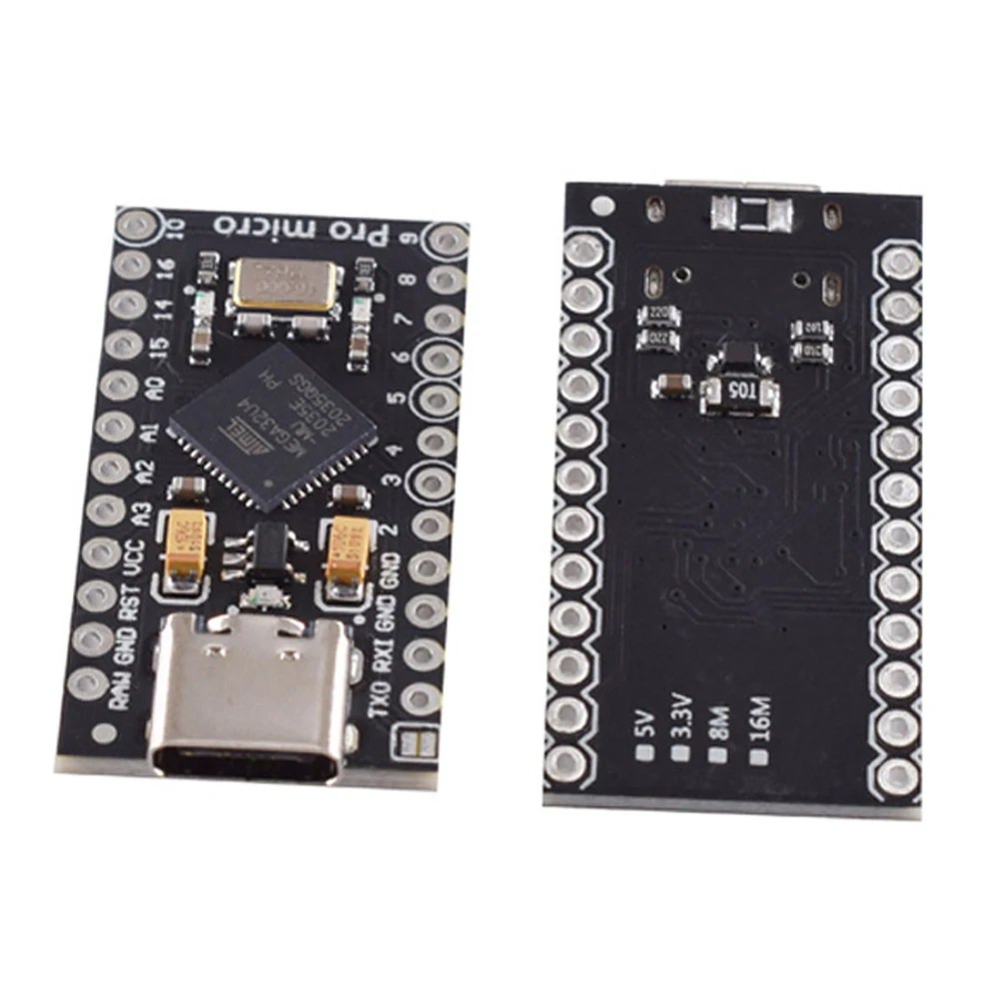

### Elite-C

Non-wireless, Atmega32u4 based. V4 version introduces midmount connector to make board thinner.

* https://www.hidtech.ca/?product=elite-c
* https://deskthority.net/wiki/Elite-C
* https://keeb.io/products/elite-c-usb-c-pro-micro-replacement-arduino-compatible-atmega32u4

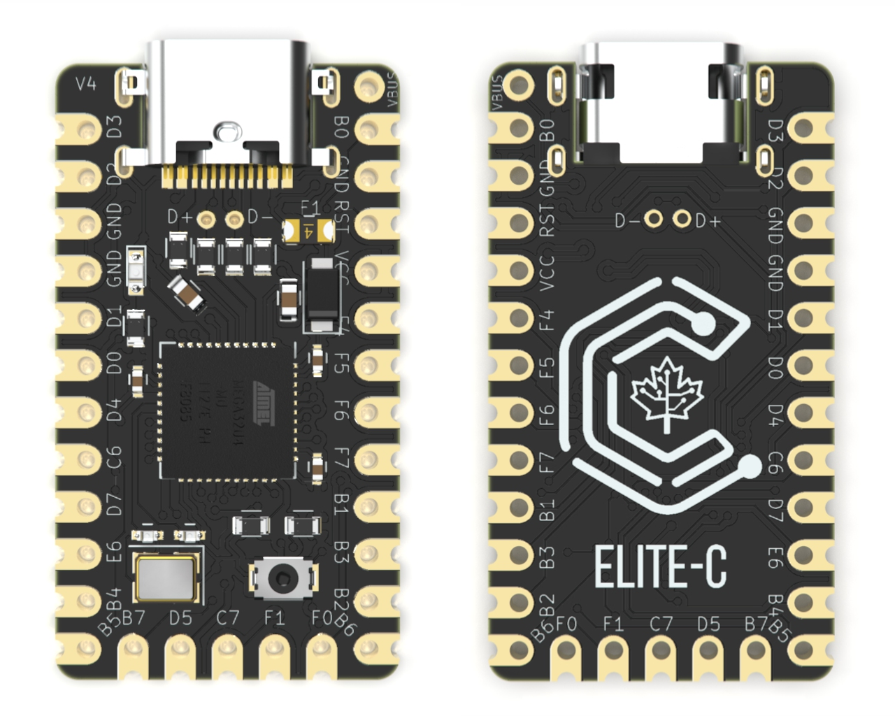

### Proton-C

Non-wireless, STM32-based. Official QMK hardware (split keyboard support has been recently pushed to upstream)

* https://qmk.fm/proton-c/

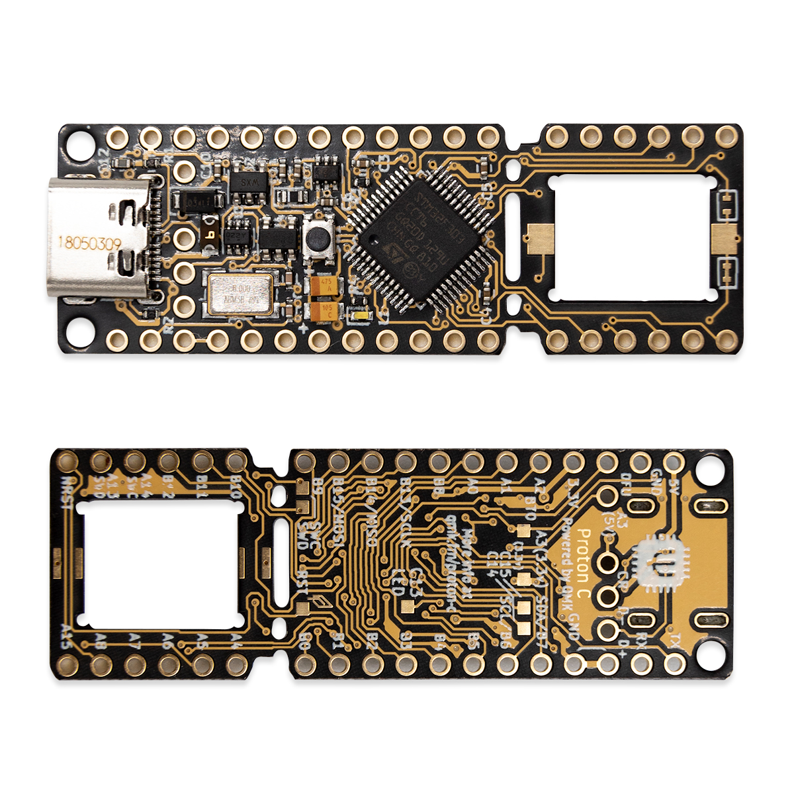

### Puchi-C

Custom, closed source (apparently) Pro Micro with USB-C board branded by https://keycapsss.com. Sells for 16.40 EUR a piece. Very few mentions. Puchi means "small" in Japanese (プチ). It also supports the spring header.

* https://keycapsss.com/media/pdf/78/e9/b9/puchi-c-pinout.pdf (Pinout)
* https://keycapsss.com/keyboard-parts/parts/141/puchi-c-pro-micro-replacement-with-usb-c-and-atmega32u4
* https://twitter.com/keycapsss/status/1356603549430472705


### RP2040 Pro Micro

AKA Raspberry pi PICO RP2040. Pro Micro-compatible pinout. Works with QMK.

* https://aliexpress.com/item/1005006097129434.html
* https://aliexpress.com/item/1005005881019149.html

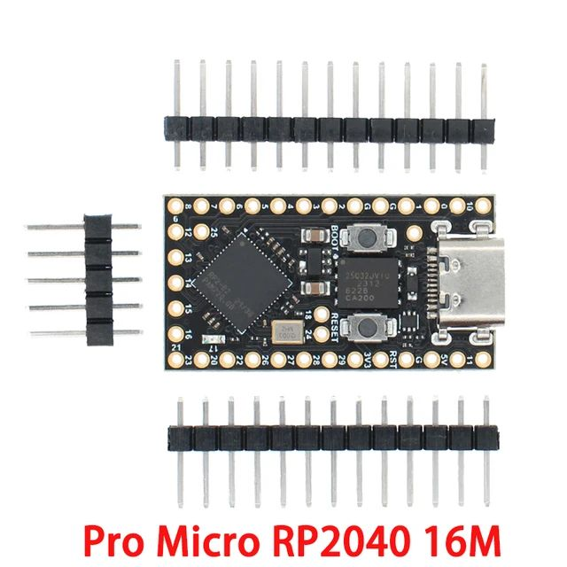

There are two versions, this one is bad, and fails a lot:

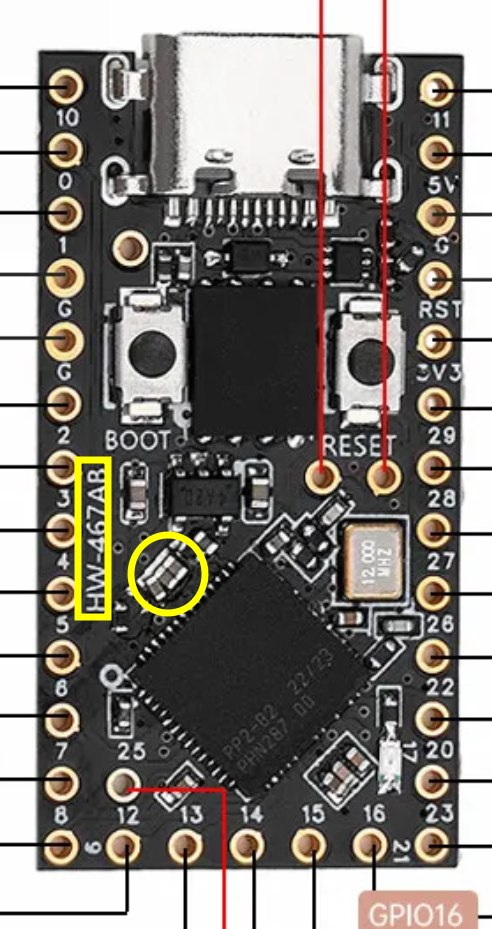

The "correct" version has smaller components and they are spaced more evenly:

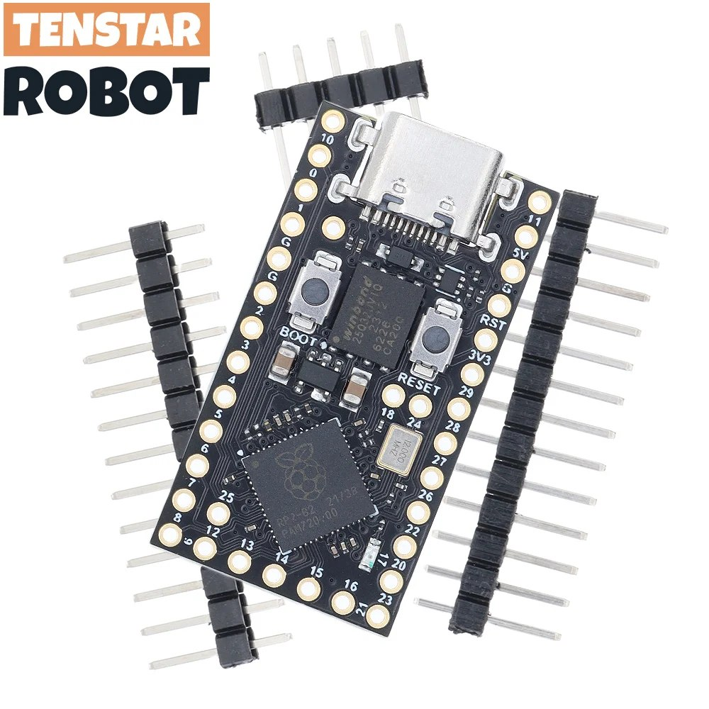


### RP2040-Zero

Non Pro Micro-compatible. Very cheap (about $1). Works with QMK.

* https://www.waveshare.com/rp2040-zero.htm
* https://aliexpress.com/item/1005004967926448.html

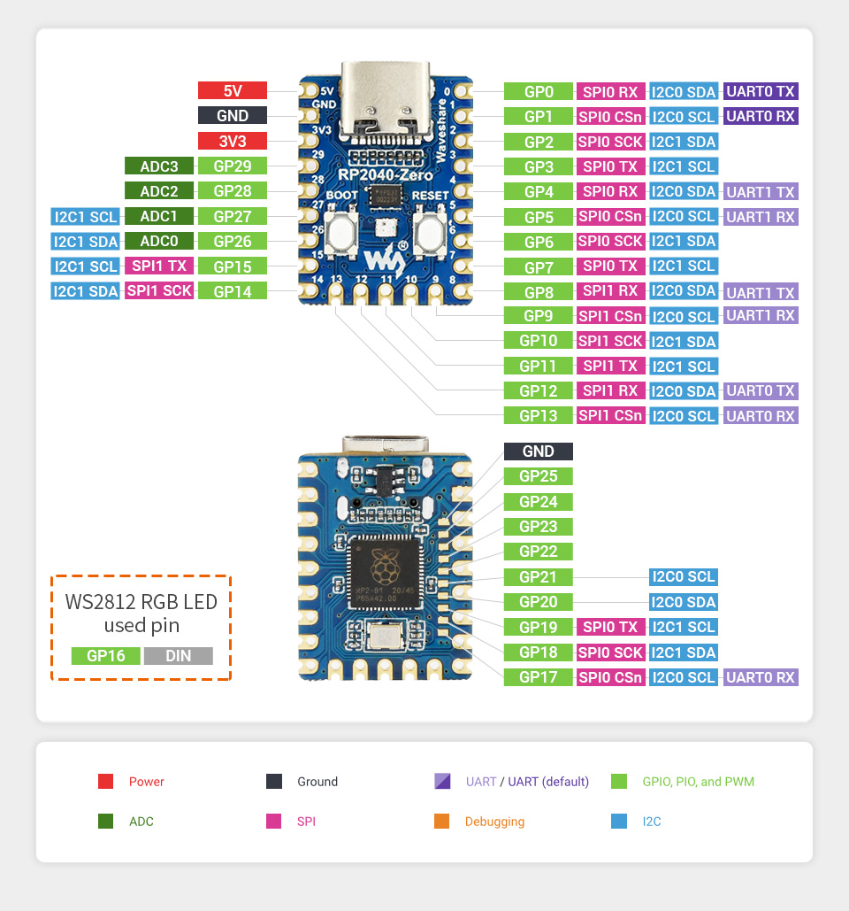

### Sea-Picro

Open-source version of RP2040 Pro Micro. Untested. The extra pin is a reset pin, also there's a version with a reset button.

* https://github.com/joshajohnson/sea-picro/
* https://customkbd.com

Sea-Picro EXT | Sea-Picro RST
---|---
| 

There is also a commercial pre-built version here:

* https://shop.beekeeb.com/product/sea-picro/


## Wired DIY boards

### Goldfish

Non-wireless, Atmega32u4-based, uses midmount USB-C connector.

* https://geekhack.org/index.php?topic=93571.0
* https://github.com/Dr-Derivative/Goldfish

Front | Back
--|--
 | 

### ShiroMicro

Non-wireless, Atmega32u4 based. Also known as AoMicro but in blue (Ao in Japanese).

* https://github.com/elfmimi/MMCProMicro
* https://www.reddit.com/r/crkbd/comments/gsomak/ao_blue_crkbd_with_aomicros/


### ShiroMicroFish

Non-wireless, Atmega32u4 based. Forked from ShirtMicro by Ariamelon. Features USB-C and extra pins.

* https://github.com/Ariamelon/MMCProMicro


### Alvaro

Non-wireless, Atmega32u4 based. Heavily-modified Goldfish Rev. C. by Ariamelon.

* https://github.com/Ariamelon/Alvaro


### Splinky

* https://github.com/plut0nium/0xB2

Pro-Micro/Elite-C replacement with USB-C and RP2040. 

* Pro-micro / Sparkfun RP2040 compatible footprint, with 5 extra pins at bottom (Elite-C style)
* Raspberry Pi RP2040 MCU
* Up to 16MB flash memory (depending on component selection and availability)
* User LED & USB VBUS detect
* Low profile USB-C mid-mount connector
* Designed to be manufactured and assembled by all common PCBA services (including JLCPCB)


### Nuvoton-based

[Nicell](https://github.com/Nicell) announced Nuvoton m4521-based board (@a_p_u_r_o from Japanese discord was the one who discovered those Nuvoton MCU's) that has a few SMD components and it's cheap to produce. It is NOT wireless. The board is intended to be opensource.

* https://www.nuvoton.com/products/microcontrollers/arm-cortex-m4-mcus/m4521-usb-series
* ARM® Cortex®-M4 with DSP and FPU
* Max frequency of 72 MHz
* 128 KB of Flash Memory
* 32 KB of SRAM
* 2-bit ADC ( up to 16 channels )
* 16-bit PWM ( up to 12 channels )
* 4 sets of 32-bit timers
* RTC
* USB 2.0 FS Host/Device
* USB 2.0 FS Crystal-less at Device mode
* Up to 4 UART s
* Up to 2 SPI s ( 1x SPI + 1xQ SPI )
* Up to 2 I²C s ( up to 1 MHz )
* Smart card interfaces
* 22.1184 MHz internal RC oscillator
* 10 kHz internal RC oscillator

_[2020-11-12](https://discord.com/channels/719497620560543766/763848253996793856/776196609369047071) Disclaimer: I have no clue if this works. It's called an m4521 from Nuvoton. Not a lot of software support, but I'm hoping to at least get Zephyr support for it.
They're extremely cheap to produce. Let me see how much it's cost me to produce 5... One sec.
$6 a piece including shipping/fees from 3 different vendors. Not bad._


You could also try [STM32F030F4P6](https://www.aliexpress.com/item/1005001394707028.html), [CKS32F030F4P6](https://www.aliexpress.com/item/4001111127571.html), [CS32F103RBT6](https://www.aliexpress.com/item/32995168104.html) and related MCUs, they cost about $0.4 a pcs.

## Partially Pro-Micro Compatible

### BlueDuino Rev2

Looks like Pro Micro, slightly larger but fits Corne, except TX/RX pins used for TRRS and LEDs are occupied by the [ILT254](https://fccid.io/2AAXH-ILT254/User-Manual/User-manual-2126527) BLE module. Does not have HID capabilities per se but probably can be flashed with CC254x HID firmware to be fully compatible with the current QMK codebase (atmega32u4 + HID via AT commands, though it wasn't tested). Does not have Li-Po charger on board. Virtually impossible to buy now.

* https://wiki.aprbrother.com/en/BlueDuino_rev2.html
* https://github.com/AprilBrother/BlueDuino/raw/master/docs/schematic/blueduino-r2.pdf
* https://www.aliexpress.com/i/32382255292.html
* https://www.seeedstudio.com/Blueduino-Rev2-Arduino-compatible-pius-BLE-CC2540-p-2550.html ($14)
* https://github.com/rampadc/cc254x-hidKbdM (experimental HID firmware for CC254x)


### Micro with 2.4G

* https://www.aliexpress.com/item/32849563958.html
* https://www.aliexpress.com/item/4000457007865.html
* https://www.aliexpress.com/item/4000467394501.html

No specs and not QMK firmware tested. Looks like a regular Pro Micro with 2.4G NRF24L01 (non-bluetooth) radio on board. 
The board is also way too long to fit on Corne. I'm not 100% sure about schematic but looks like 24L01 is hooked to pins 7 and 8 (pin 7 is used as ROW3 on Corne), those pins are used for 24L01 very often as so:

```cpp
#include <RF24.h>
RF24 radio(7, 8); // CE, CSN
```

It's also uses global 3.3V power and apparently overclocked at 16 MHz because NRF24L01 wants 3.3V and there's only one LDO on the board. From its [Aliexpress customer reviews](https://www.aliexpress.com/item/4000457007865.html): _The ATmega32U4 runs at 3.3V and 16MHz - that is like an overclocked 3V/8MHz pro micro, but its working perfectly fine so far._


## Non Pro Micro Compatible

### XIAO

There are 3 versions: Wired, BLE, BLE Sense. They are really nice, and highly recommended for small split keyboards.

Example keyboards:

* https://github.com/lehmanju/corne-xiao
* https://github.com/PJE66/hummingbird
* https://github.com/ergonautkb/one

#### Seeduino XIAO BLE (Sense)

nRF52840-based with onboard Li-Po charger. 11 GPIO pins plus 2 NFC pins on the back side, so 13 GPIO pins total. 11 pins give us 6x5 = 30 key matrix, should be enough for a split keyboard (maybe we can have OLED screen hooked up on NFC pins).

* Onboard PDM microphone MSM261D3526H1CPM (only in XIAO BLE Sense)
* Onboard 6-axis Gyroscope LSM6DS3TR-C IMU (only in XIAO BLE Sense)
* Powerful wireless capabilities: Bluetooth 5.0 with onboard antenna
* Powerful CPU: Nordic nRF52840, ARM® Cortex®-M4 32-bit processor with FPU, 64 MHz
* Ultra-Low Power: Standby power consumption is less than 5 uA
* Battery charging chip: Supports lithium battery charge and discharge management
* Onboard 2 MB flash
* Ultra Small Size: 20 x 17.5mm, XIAO series classic form-factor for wearable devices
* Rich interfaces: 1xUART, 1xI2C, 1xSPI, 1xNFC, 1xSWD, 11xGPIO(PWM), 6xADC
* Single-sided components, surface mounting design

Schematic is open: https://files.seeedstudio.com/wiki/XIAO-BLE/Seeed-XIAO-nRF52840-v1.0-SCH.zip

* MCU: nRF52840 (BLE) or ATSAMD21G18A-MU (wired)
* Battery charger: BQ25100, uses battery divider 1M/510K (pins 0.31/AIN7, 0.14/pulldown)
* Red charging LED (pin 0.16), common anode RGB LED (pins 0.26, 0.30, 0.06)
* Switchable power source, uses P-MOS (1x0.35mm) and Schottky diode.
* Low leak 3.3V regulator (XC6206P332MR)
* QSPI flash (2MB)

You can buy it here:

* https://www.seeedstudio.com/Seeed-XIAO-BLE-nRF52840-p-5201.html ($10 for BLE, $16 for BLE sense with a mic)
* https://wiki.seeedstudio.com/XIAO-BLE-Sense-Getting-Started/
* https://www.aliexpress.com/item/1005004021078832.html ($23.52)
* https://www.aliexpress.com/item/1005003993016972.html ($17.55)
* https://www.aliexpress.com/popular/seeeduino-xiao-ble.html (search)


#### Seeduino XIAO (Wired)

Miniature Pro Micro clone with USB-C connector.
Non-wireless Used in [Zaphod Lite](https://twitter.com/petejohanson/status/1454596075235459079) keyboard along with a GPIO expander
(there are just too few GPIO pins for a keyboard). See https://wiki.seeedstudio.com/Seeeduino-XIAO/

* Powerful CPU: ARM® Cortex®-M0+ 32bit 48MHz microcontroller(SAMD21G18) with 256KB Flash,32KB SRAM.
* Flexible compatibility: Compatible with Arduino IDE.
* Easy project operation: Breadboard-friendly.
* Small size: As small as a thumb(20x17.5mm) for wearable devices and small projects.
* Multiple development interfaces: 11 digital/analog pins, 10 PWM Pins, 1 DAC output, 1 SWD Bonding pad interface, 1 I2C interface, 1 UART interface, 1 SPI interface.


#### ProXiao 

Seeduino XIAO BLE Shield

* GitHub: https://github.com/aroum/proXiao (may be a dead link)
* Where to buy: search https://www.reddit.com/r/ru_mechmarket/

It messes up some pins because the layout is so different, but still works pretty well.

The XIAO board is much smaller than Pro Micro, pins don't match either. XIAO to Pro micro overlay for comparison:


Pro-Xiao is based on the schematic above. The hardware is closed source.

Supports a lot of keyboards:


More photos:


#### XiaoPro

There's an open-source XIAO to Pro Micro adapter shield, called Xiao-Pro (SMD only):

* https://www.reddit.com/r/olkb/comments/1dq730z/xiao_to_pro_micro_conversion_board_open_source
* https://github.com/gargum/Xiao-Pro

Front | Back
---|---
|

#### MINI nRF52840

A cheap XIAO clone by [UICPAL](https://aliexpress.com/store/1102351032). Costs $7.5. Spotted in the wild 2025-03-04.

* https://aliexpress.com/item/1005008563470913.html _MINI NRF52840 Development Board BT5.0 Bluetooth Module MCU Main Control Board 18*21MM QSPIFlash TYPE-C_

Looks like SuperMini NRF52840 Zero but the pinout is from XIAO. Features QSPI flash.

**WARNING!** Battery polarity silk doesn't match XIAO. Either a misprint or an issue. **Upd.** later batches (Sep. 2025) are [fixed](https://t.me/klavaorgwork/860678) (top pad is B-), earlier batches (spring 2025) are [wrong](https://t.me/klavaorgwork/860687) (top pad is B+).


<br>_earlier batches (spring 2025)_


<br>_later batches (September 2025)_


### SuperMini NRF52840 Zero

I don't quite know how to call it (name pending) it's also called SuperMini NRF52840 but in [[RP2040-Zero|Alternatives#rp2040-zero]] form factor. Costs about the same as a Pro Micro-sized SuperMini. It's NOT compatible with XIAO BLE layout. Untested.


* https://aliexpress.com/item/1005006064293401.html


#### Super-nRF52840

Same as MINI nRF52840 above but with its own github (added 2025-01-12).

A DIY board made in XIAO form factor ([ZMK Discord](https://discord.com/channels/719497620560543766/1157825408130101349/1393555559520800768)).

* https://github.com/NologoTech/Super-nRF52840
* https://github.com/WMnologo/Super-nRF52840/blob/main/README_CN.md
* https://github.com/NologoTech/Super-nRF52840/issues/4
* https://www.aliexpress.com/item/1005008563470913.html

Super nRF52840 is a replacement for the Xiao nRF52840, and they share the same pinout. Super52840 uses the Xiao bootloader, and compared to the Xiao nRF52840, it provides 7 additional I/O pins located on the back of the board (P0.31, P0.15, P0.19, P1.01, P1.03, P1.07, P1.05).

The Super nRF52840 features the powerful Nordic nRF52840 MCU, integrated with Bluetooth 5.0 connectivity, and comes in a compact and sleek form factor, making it ideal for wearable devices and IoT projects. The single-sided PCB design and onboard Bluetooth antenna greatly facilitate the rapid deployment of IoT projects.

Super52840 integrates a charging indicator LED and a tri-color LED. It offers 11 digital I/O pins that can be used as PWM pins, and 6 analog I/O pins that can serve as ADC inputs. It supports three common serial interfaces: UART, I2C, and SPI. The board also includes 2MB onboard memory, and can be programmed using Arduino, MicroPython, CircuitPython, or other programming languages.

* Processor: Nordic nRF52840, ARM® Cortex®-M4 32-bit processor with FPU, 64 MHz
* Wireless: Bluetooth 5.0/BLE/NFC
* Memory: 256KB RAM, 1MB Flash, 2MB onboard memory
* Interfaces: 1x I2C, 1x UART, 1x SPI
* PWM/Analog pins: 11/6
* Onboard Buttons: Reset button
* Onboard LEDs: Charging indicator LED, tri-color LED
* Programming Languages: Arduino, MicroPython, CircuitPython

Pictures:


### Adafruit ItsyBitsy nRF52840 Express

* https://www.adafruit.com/product/4481
* https://learn.adafruit.com/adafruit-itsybitsy-nrf52840-express
* https://cdn-learn.adafruit.com/downloads/pdf/adafruit-itsybitsy-nrf52840-express.pdf

Sells for $17.95. Uses [MDBT50Q module](https://github.com/joric/nrfmicro/wiki/Alternatives#raytac-mdbt50q). The pinout is NOT Pro Micro compatible. Does NOT have Li-Po charger on board (needs a [Li-Po charger backpack](https://www.adafruit.com/product/2124) which is sold separately for $4.95). The board size is 36x18mm, 3mm longer than Pro Micro (14 pins in a row instead of 12-13) and a little bit taller (SMD components on both sides). Has 6 power pins, 21 digital GPIO pins (6 of which can be analog in). Uses MicroUSB connector. [Confirmed](https://www.reddit.com/r/MechanicalKeyboards/comments/f3uod6/made_a_bluetoothwired_split_ergo_keyboard/fhlc0km/) to work with QMK (nRF52 branch).


### Adafruit Feather nRF52840 Express

NOT Pro-Micro compatible. Uses [MDBT50Q module](https://github.com/joric/nrfmicro/wiki/Alternatives#raytac-mdbt50q). Schematic and PCB are open source. Sells for $24.95. Not QMK firmware tested.

* https://www.adafruit.com/product/4062
* https://github.com/adafruit/Adafruit-nRF52-Bluefruit-Feather-PCB
* [Adafruit Feather nRF52840 Express Downloads](https://learn.adafruit.com/introducing-the-adafruit-nrf52840-feather/downloads)
* [Adafruit Feather nRF52840 Express Schematic](https://cdn-learn.adafruit.com/assets/assets/000/068/545/original/circuitpython_nRF52840_Schematic_REV-D.png)
* [Adafruit Feather nRF52840 Express pinout (read carefully)](https://learn.adafruit.com/introducing-the-adafruit-nrf52840-feather/pinouts)


### Adafruit Bluefruit LE UART Friend

nRF51822-based, UART-controlled.

* https://www.adafruit.com/product/2479


It's probably possible to use Adafruit Bluefruit LE UART Friend HID firmare for nRF51822:

* https://github.com/adafruit/Adafruit_BluefruitLE_Firmware
* https://learn.adafruit.com/introducing-the-adafruit-bluefruit-le-uart-friend/software
* https://learn.adafruit.com/introducing-the-adafruit-bluefruit-le-uart-friend/hidkeyboard

### Particle.io Xenon

NOT Pro-Micro compatible. Open source, nRF52840-based, assembled board sells for about $15. No module is used, nRF52840 soldered on board. Meets the Adafruit Feather [specification](https://learn.adafruit.com/adafruit-feather/feather-specification) in dimensions and pinout. Not QMK firmware tested.

* https://docs.particle.io/xenon
* https://store.particle.io/products/xenon
* https://docs.particle.io/datasheets/mesh/xenon-datasheet
* https://github.com/particle-iot/xenon


### Arduino Nano 33 BLE

NOT Pro-Micro compatible (rather, Nano-compatible), does NOT have a Li-Po charger on board. Sells for [$19 on arduino.cc](https://store.arduino.cc/usa/nano-33-ble). Uses [NINA B306](https://www.u-blox.com/sites/default/files/NINA-B3_DataSheet_%28UBX-17052099%29.pdf) module (nRF52840-based). It's much longer than Pro Micro and power pins are on the other edge of the board from the MicroUSB connector, also power pins are a little bit scrambled, note RST, GND and VCC locations. Not QMK firmware tested.

* https://store.arduino.cc/usa/nano-33-ble
* https://www.u-blox.com/sites/default/files/NINA-B3_DataSheet_%28UBX-17052099%29.pdf


### BLE-Nano

* https://www.aliexpress.com/item/33006686263.html

CC-2540 and Atmega32u4-based Nano-sized board. Probably eligible for QMK if you flash CC2540 with RN-42 like HID firmware.

* https://github.com/joric/cc2540-keyboard
* https://github.com/rampadc/cc254x-hidKbdM (experimental HID firmware for CC254x)
* https://imgur.com/a/KWmz6 (Turning HM-10, HM-11 into Bluetooth HID modules)

side|pins
---|---
 | 


### nRF52840 Dongle

Original nRF52840-based USB donlge from Nordic. Does NOT have a Li-Po charger on board. USB-A PCB connector. Schematic is open. 2-layer PCB with a PCB antenna. Sells for about $18. You can use it as nRF52840 module replacement or as an USB dongle, you decide. Should work with QMK/ZMK though I didn't really check that. Also see [USB-A](#usb-a).

* https://www.nordicsemi.com/Products/Development-hardware/nRF52840-Dongle
* https://www.aliexpress.com/item/32913393879.html


### nRF52840 Micro Dev Kit USB Dongle

Reduced size, unoriginal nRF52840-based USB Dongle. Does NOT have a Li-Po charger on board. USB-A PCB connector. About the same as Nordic dongle but uses a small chip antenna. 

* https://www.aliexpress.com/item/4000246750580.html


### SparkFun MicroMod nRF52840 Processor (M2)

An extension board that reuses M2-connectors. Not compatible with an actual M2 as it doesn't have PCI or SATA bus, but it routes out up to 74 pins, may be useful. Used on some DIY Korean or Chinese keyboards.

* https://learn.sparkfun.com/tutorials/micromod-nrf52840-processor-hookup-guide
* https://www.reddit.com/r/MechanicalKeyboards/comments/la327q/hardware_idea_keyboard_pcb_accepting_sparkfun/
* https://github.com/tzarc/ghoul


## Modules

Moved to [[Modules]].

## Adapters

Moved to [[Adapters]].

